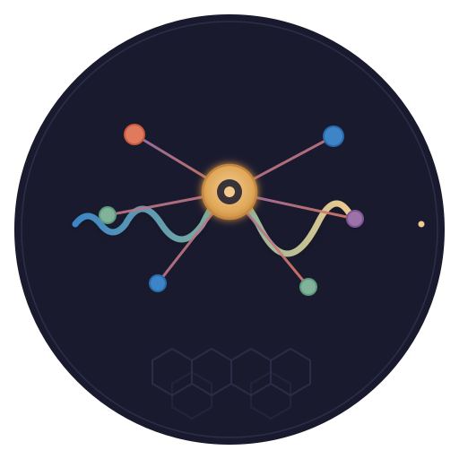

<p align="center">
  
</p>

<h1 align="center">neural amplifier</h1>

<p align="center">
  <em>🧠 An LLM brain for <a href="https://github.com/afwbkbc/glsmac">GLSMAC</a> — Alpha Centauri, played by Claude</em>
</p>

<p align="center">
  <a href="LICENSE"></a>
  <a href="https://github.com/afwbkbc/glsmac"></a>
  <a href="https://github.com/casey/just"></a>
  <a href="VISION.md"></a>
</p>

> *The board is the signal. The model is the amplifier. Strategy is what comes out.* 🛰️

In *Sid Meier's Alpha Centauri*, a **Neural Amplifier** is a base facility that strengthens
a colony's collective mind — amplifying the will of the many into something more than the
sum of its parts. This project borrows the name and the idea: it plugs an LLM into
[GLSMAC](https://github.com/afwbkbc/glsmac), the open-source reimplementation of Alpha
Centauri, takes the raw signal of the game board, and **amplifies it into strategy** —
playing a faction on its own or advising a human at the wheel.

## 🎬 See It In Action

```text
turn 42 · 2142 AD · faction GAIANS  ────────────────────────────────

  world view  → 128 visible tiles, 6 units, 2 bases, research 60%
  claude      → "Ridge to the NE has +2 minerals and a defensible
                 chokepoint. Send the former to terraform, escort with
                 the scout. Hold expansion — the Hive is massing east."

  orders      ✓ move_unit former → (13,8)   [accepted]
              ✓ move_unit scout  → (14,8)   [accepted]
              ✓ set_production Gaia's Landing → Recycling Tanks
              ✓ end_turn
```

Every turn, Neural Amplifier hands Claude a compact, fog-of-war-limited picture of the game
and a menu of *legal* moves; Claude reasons about it in the open and returns orders; the game
validates and executes them. Same loop, two modes: **autonomous opponent** or **human
copilot**.

## 🤔 Why Neural Amplifier?

|  | **Built-in 4X AI** | **Scripted bots** | **Neural Amplifier** |
|--|:-----------------:|:-----------------:|:--------------------:|
| Exists for GLSMAC today | ❌ | ❌ | ✅ |
| Reasons about long-horizon tradeoffs | ❌ | ❌ | ✅ |
| Explains *why* it made a move | ❌ | ❌ | ✅ |
| Every input fully inspectable | ❌ | ⚠️ | ✅ |
| Plays fair (fog-of-war respected) | ⚠️ (often cheats) | ⚠️ | ✅ |
| Doubles as a human copilot | ❌ | ❌ | ✅ |
| No hard-coded heuristics to maintain | ❌ | ❌ | ✅ |

GLSMAC has **no computer opponents yet** (they're on its own roadmap for ~v0.7). Classic 4X
AI leans on scripted heuristics and difficulty cheating; an LLM already understands Alpha
Centauri and can weigh fuzzy strategy the way a person does — *and say so out loud*.

## ✨ How It Works

A platform-agnostic **brain** plus thin **adapters** that attach it to a running game. The
brain never knows which game it's driving — it speaks one [contract](docs/contract.md).

**🐍 Orchestrator (Python + Claude Agent SDK) — the brain**

- Owns everything LLM-shaped: prompt assembly, tool-use loops, retries, streaming, secrets,
  memory, move validation, and safe degradation.
- Takes a **world view** in, returns **structured orders** (with reasoning) out — over HTTP.
  The same code drives either engine.

**🔌 Two engine adapters — the hands**

- **Thinker (near-term):** a fork of the MIT/C++ [Thinker](https://github.com/induktio/thinker)
  mod that bridges the original `terranx.exe`'s AI hooks. The **complete, balanced** game —
  production, tech, diplomacy, real fog — controllable on day one.
- **GLSMAC (long-term):** a `.gls.js` mod + a small GSE `http` builtin for the open-source
  engine. Clean and testable, but its game systems are still being built.

**🧠 Two tiers of decision**

- A **deterministic tier** (classic-AI heuristics, in the engine) handles the mechanical work.
  The **LLM tier** sets policy and drills down to any unit or base when it chooses — so Claude
  is consulted a few times a turn, not for every twitch.

**🔍 Legible by design**

- Context leaves the game as plain JSON over HTTP — every turn's input to Claude and every
  decision back out is logged, replayed, and audited. No black box.

## 🏗️ Architecture

```text
        ┌──────────────────────────────┐
        │   orchestrator (Python)       │  brain · MIT · platform-agnostic
        │   prompt · validate · memory  │
        └───────▲───────────────┬──────┘
         world  │               │ orders     ← the shared CONTRACT (JSON/HTTP)
          view  │               ▼
        ┌───────┴───────────────────────┐
        │            adapter             │
        │  ┌───────────┐  ┌───────────┐  │
        │  │ thinker   │  │ glsmac    │  │
        │  │ → terranx │  │ → GSE mod │  │
        │  └───────────┘  └───────────┘  │
        └───────────────────────────────┘
```

Two sibling services layer on **knowledge** and **guardrails**: [Quipu](https://github.com/scbrown/quipu)
is a governed bitemporal graph holding the SMAC datalinks and the brain's learned strategy across
games; [Hank](https://github.com/scbrown/hank) is a hot in-memory graph that runs strategic
policy checks and what-if analysis on the live board. The engine's `action_space` stays the hard
legality gate; the knowledge layer only annotates, constrains, and remembers. Design:
**[docs/knowledge-architecture.md](docs/knowledge-architecture.md)**.

Full design — the contract Claude speaks, the two-engine strategy, and the roadmap — lives in
**[VISION.md](VISION.md)**.

## 🚀 Quick Start

> **Status: pre-alpha.** The repo currently holds the vision, architecture, and project
> scaffold. The component tree below is where the code lands, phase by phase (see
> [VISION.md](VISION.md) §Roadmap).

```bash
git clone https://github.com/scbrown/NeuralAmplifier && cd NeuralAmplifier
just --list          # See available recipes
just setup           # Install pre-commit hooks
just check           # Run the quality gate
```

Layout:

```text
orchestrator/       Python brain — the LLM decision loop (Claude Agent SDK) · MIT
adapters/
  thinker/          Near-term: DLL bridge to terranx.exe (MIT)
  glsmac/           Long-term: .gls.js mod + GSE http builtin (AGPL boundary)
docs/               contract.md, building-and-testing.md, adapter notes
```

## 🛠️ Development

```bash
just build               # Build all components
just test                # Run all tests
just lint                # Lint everything
just check               # Full quality gate (pre-commit hooks)
just orchestrator test   # Component-scoped recipes: <component> <cmd>
just glsmac test         # GLSMAC adapter (headless --gse-tests)
just thinker build       # Thinker adapter (needs the Thinker toolchain)
just docs check          # Markdown lint
```

`just` is the single entry point — see [CONTRIBUTING.md](CONTRIBUTING.md). Pre-commit hooks
and CI run the same quality gate on every push. How each component is built and tested is
documented in **[docs/building-and-testing.md](docs/building-and-testing.md)**.

## 🤝 Contributing

See [CONTRIBUTING.md](CONTRIBUTING.md) for setup and guidelines, and [AGENTS.md](AGENTS.md)
if you're an AI agent working in this repo.

## 📄 License

[MIT](LICENSE) for this repository — the Python orchestrator, the Thinker adapter (Thinker is
MIT too), the `.gls.js` mod, and the docs.

**One boundary to know:** the GSE `http` builtin under `adapters/glsmac/builtin/` modifies
[GLSMAC](https://github.com/afwbkbc/glsmac), which is **AGPL-3.0**. Those engine-side changes
inherit AGPL-3.0 and are meant to be contributed upstream — a reason we keep that surface small
and separate. See [adapters/glsmac/README.md](adapters/glsmac/README.md).
