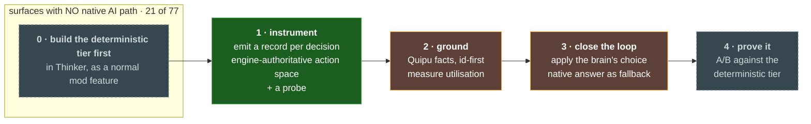

<p align="center">
  
</p>

<h1 align="center">neural amplifier</h1>

<p align="center">
  <em>🧠 An LLM brain for <em>Sid Meier's Alpha Centauri</em> — played by Claude</em>
</p>

<p align="center">
  <a href="LICENSE"></a>
  <a href="VISION.md#3-two-engines-one-brain"></a>
  <a href="docs/knowledge-architecture.md"></a>
  <a href="https://github.com/casey/just"></a>
  <a href="VISION.md"></a>
</p>

> *The board is the signal. The model is the amplifier. Strategy is what comes out.* 🛰️

In *Sid Meier's Alpha Centauri*, a **Neural Amplifier** is a base facility that strengthens
a colony's collective mind — amplifying the will of the many into something more than the
sum of its parts. This project borrows the name and the idea: it plugs an LLM into a
**controllable Alpha Centauri** — the complete original game via [Thinker](https://github.com/induktio/thinker)
now, the open-source [GLSMAC](https://github.com/afwbkbc/glsmac) engine long-term — takes the
raw signal of the game board, and **amplifies it into strategy** — playing a faction on its own
or advising a human at the wheel. One brain, either engine, behind a single
[contract](docs/contract.md).

## 🎬 See It In Action

The engine raises a **decision surface**, the orchestrator hands Claude a fog-limited world view
and the *legal* options, and the answer is validated against the engine's own tests before it
runs:

```text
turn 42 · 2142 AD · GAIANS  ─────────────────────────────────────────

  surface     base.production        scope base   Gaia's Landing
  metrics     minerals +2 · reserves 82 · drones 1 · bases 2
  history     t40 facility:4 (llm) · t41 facility:4 (llm)

  action_space
    unit:0        Colony Pod        cost 30   FOUNDS A NEW BASE elsewhere
    facility:4    Recycling Tanks   cost 40   +minerals +nutrients

  claude      → facility:4
                "Two bases at turn 42 is behind, but this base makes
                 2 minerals a turn — a pod costs 15 turns of that.
                 Tanks first, then expand from a base that can pay."

  guards      StateGuard    ok      affordable
              CitationGuard ok      2 cited facts resolve
              YupanaGuard   ok      board clean
  applied     facility:4  ← engine kept it (na_verify_base_production)
```

The brain never learns which engine it is driving — Thinker and GLSMAC meet it behind one
[contract](docs/contract.md). And it can also act *outside* the ask-and-answer cycle: `move`,
`skip` and `build` on the command channel drive any unit or base directly.

```text
  > build 0 -4        # Gaia's Landing → Recycling Tanks
  > move 7 13 8       # former → ridge
  > skip 9            # scout holds
```

Same loop, two modes: **autonomous opponent** or **human copilot**.

> The transcript above is the real record shape — surfaces, metrics, history, action space,
> guard chain and the post-apply check are all wired and tested. What has *not* happened yet is
> a decision executing inside a running game; see **Coverage & Plan**.

## 🤔 Why Neural Amplifier?

| | **Built-in 4X AI** | **Scripted bots** | **Neural Amplifier** |
| -- | :-----------------: | :-----------------: | :--------------------: |
| Reasons about long-horizon tradeoffs | ❌ | ❌ | ✅ |
| Explains *why* it made a move | ❌ | ❌ | ✅ |
| Every input fully inspectable | ❌ | ⚠️ | ✅ |
| Plays fair (fog-of-war respected) | ⚠️ (often cheats) | ⚠️ | ✅ |
| Doubles as a human copilot | ❌ | ❌ | ✅ |
| Grounded in the game's rules + real strategy, not hard-coded heuristics | ❌ | ❌ | ✅ |

> **On "plays fair":** that's a design commitment, not a freebie. SMAC hands non-human factions
> a systematic bonus layer — cheaper tech, free unit support, no retool penalty, no global
> warming below Transcend. Neural Amplifier keeps a
> [fairness ledger](docs/game-surface.md#5-rule-asymmetries-the-fairness-ledger) of all of them
> and **declares whichever are active** in the world view, so every result is interpretable and
> Claude reasons about its own advantages out loud. Play it on a human slot and the list is
> empty — that's the configuration behind an unqualified fair-play claim.

The original game's AI is dated and leans on difficulty cheating; the open-source engine has
**no computer opponents yet**. An LLM already understands Alpha Centauri and can weigh fuzzy,
long-horizon strategy the way a person does — *and say so out loud*. Neural Amplifier goes
further than raw training memory: it grounds that reasoning in the game's actual rules and in
curated strategy (see **Knowledge & Guardrails** below), so it plays *well*, not just legally.

## ✨ How It Works

A platform-agnostic **brain** plus thin **adapters** that attach it to a running game. The
brain never knows which game it's driving — it speaks one [contract](docs/contract.md).

**🐍 Orchestrator (Python) — the decision loop**

- Owns everything that makes a decision *legal and legible*: fog gating, grounding retrieval,
  directive trade-offs, action-space validation, the policy guard, the decision record.
- Takes a **world view** in, returns **structured orders** (with reasoning) out — over HTTP.
  The same code drives either engine.

**🎮 The brain is pluggable — and can be an agent in your terminal**

- `NA_BRAIN=agent` makes the orchestrator *serve* decisions instead of calling a model. Claude
  Code (or anything speaking MCP) attaches, collects the world view, and answers.
- Control inverts, invariants do not: an agent is not a privileged client, and its orders go
  through the same validation, guard and record a model's would. It cannot name a move the
  engine did not offer.
- Any harness plugs in the same way — it attaches and asks. Neural Amplifier launches nothing.
  See **[docs/agent-play.md](docs/agent-play.md)**.

**🔌 Two engine adapters — the hands**

- **Thinker (near-term):** a fork of the MIT/C++ [Thinker](https://github.com/induktio/thinker)
  mod that bridges the original `terranx.exe`'s AI hooks. The **complete, balanced** game —
  production, tech, diplomacy, real fog — controllable on day one.
- **GLSMAC (long-term):** a `.gls.js` mod + a small GSE `http` builtin for the open-source
  engine. Clean and testable, but its game systems are still being built.

**🧠 Two tiers of decision**

- A **deterministic tier** (classic-AI heuristics, in the engine) handles the mechanical work.
  The **LLM tier** sets policy and drills down to any unit or base when it chooses — so Claude
  is consulted a few times a turn, not for every twitch.

**🔍 Legible by design**

- Context leaves the game as plain JSON over HTTP — every turn's input to Claude and every
  decision back out is logged, replayed, and audited. No black box.

## 🏗️ Architecture

```text
        ┌──────────────────────────────┐
        │   orchestrator (Python)       │  brain · MIT · platform-agnostic
        │   prompt · validate · memory  │
        └───────▲───────────────┬──────┘
         world  │               │ orders     ← the shared CONTRACT (JSON/HTTP)
          view  │               ▼
        ┌───────┴───────────────────────┐
        │            adapter             │
        │  ┌───────────┐  ┌───────────┐  │
        │  │ thinker   │  │ glsmac    │  │
        │  │ → terranx │  │ → GSE mod │  │
        │  └───────────┘  └───────────┘  │
        └───────────────────────────────┘
```

Full design — the contract Claude speaks, the two-engine strategy, and the roadmap — lives in
**[VISION.md](VISION.md)**.

## 📊 Coverage & Plan

**4 of 77 decision surfaces the brain can actually decide**, plus **8 it can watch**. Those are
two different numbers and conflating them overstates coverage by half. A surface is not covered
until its decision can be *applied*; observing changes what is recorded, not what the game does.
`just surfaces` prints both from the frozen registry rather than from this table. The registry
is frozen at 77 (`orchestrator/surfaces.py`), partitioned by contract scope: `base` 25,
`unit` 32, `turn` 20.

| Surface | Scope | Status |
| --- | --- | --- |
| `base.production` | base | **Applied** · posts the world view and applies the returned build, falling back to the engine's own answer |
| `faction.tech` | turn | **Applied** · posts the world view and applies the returned tech, falling back to the engine's own answer |
| `faction.se` | turn | **Applied** · applies the returned social model, refusing one the faction cannot afford |
| `base.hurry` | base | **Applied** · spends or holds, through the engine's own `hurry_item` |
| `econ.energy_sliders` | turn | Observed · records what `mod_allocate_energy` chose and every split that was legal |
| `base.retool` | base | Observed · the odd one — its deterministic tier already existed inside `select_build`, so what was missing was the *record*, not an answer |
| `base.staple` | base | Observed · nerve stapling, recorded only when the engine's eligibility gate opened |
| `econ.corner_market` | turn | Observed · cornering the energy market — a move toward economic victory |
| `council.call` | turn | Observed · convening the Planetary Council, read as a state transition because `call_council` returns nothing |
| `base.satellite` | base | Observed · all four orbitals with per-option availability, built count and faction goal |
| `base.project` | base | Observed · every buildable secret project with the engine's own score under this base's governor weights |
| `faction.tech_steal` | turn | Observed · every tech the target holds and we do not — not the research menu, which is a different set |

Every surface ships a **side-effect-free probe** (`observe`, `observe-tech`, `observe-se`,
`observe-hurry`, `observe-retool`, `observe-staple`, `observe-corner`, `observe-council`,
`observe-satellite`, `observe-project`, `observe-steal`) because in-game input cannot be driven at all, so a decision that fires
every five to ten turns is otherwise unverifiable without playing until it happens.

**The observed eight are not a waiting room.** Each has a working native answer, which is what
makes recording one safe from the first row — invariant 9 needs nothing built first. Their value
is the `native_choice`: a baseline nobody wrote down cannot be A/B'd against a brain later. Every
adapter record is transcribed into `test_adapter_contract.py` and diffed *mechanically* against
its C++ emitter, because the adapter writes the contract by hand with `snprintf` and an
`extra="allow"` model swallows a misnamed field in silence.

In-game **dialogs** are intercepted too (invariant 7) — one hook on the engine's `popp` function
pointer, so every dialog Thinker raises is seen without patching a single call site. Nothing is
suppressed; a dialog the table does not recognise is recorded and flagged so the inventory can be
built from a real game rather than guessed.

All four **emit the contract directly** — no translation layer between the adapter and the brain.

Each was **observed before it was applied** — deliberately, because that makes a surface
falsifiable on its own before anything depends on it. Which surfaces the brain may decide is set
per surface in the `[surfaces]` section of [`na.toml`](na.toml), so the sequence is: instrument, watch it
observe, then let it decide.

`base.production` is the first surface to finish that sequence, and the first where the brain's
answer actually executes. Three gates make that safe rather than hopeful: the returned id must
parse as one the adapter minted, the item must pass the *engine's own* availability tests for that
base, and the whole exchange is bounded by `llm_timeout_ms` (default 2500 ms). Every failure —
unreachable orchestrator, timeout, malformed reply, illegal id — applies the deterministic tier's
choice and records why.

> **Built, not yet proven.** The wire is tested end-to-end under Wine against a real orchestrator
> (`just thinker wire`), but no decision has executed inside a running game — that needs a game
> fixture and the unattended harness. Honest status: the loop closes in the code and has not yet
> closed on a board.

### The plan, in dependency order



**Step 0 is the one that is easy to skip and expensive to skip.** 21 of the 77 surfaces
(`surfaces.NO_AI_PATH`) are decisions the native AI *never makes* — `base.abandon`,
`council.vote`, `diplo.base_swap`. Putting an LLM straight onto those breaks
[invariant 9](AGENTS.md): *degrade safely.* There is no native choice to fall back to when the
model is slow, over budget, or wrong, so a failure there stalls or corrupts a turn rather than
quietly reverting to a competent default.

So those surfaces get the deterministic tier **first** — built in the Thinker fork as an ordinary
mod feature, the way Thinker already improves production and movement AI — and only then the LLM
tier on top of it. That also means the work is independently useful: a better deterministic tier
improves the game whether or not a brain is attached, and it gives the LLM something to be measured
*against* rather than merely compared to.

One of the 21 turned out **not** to need step 0 at all. `base.retool` already had a working
deterministic tier folded into `select_build` — a category-crossing penalty of 400, or 800 with a
secret project at risk. What was missing was never an answer; it was the *record*. Worth stating
because it is the cheerful failure mode of a list like this: a surface can sit in the
build-it-first pile for months because nobody read the function that already does the work. The
other 13 uninstrumented ones were audited in the same pass; `base.retool` was the outlier.

Of the 65 not yet instrumented, **25 are `unit`-scope** and mostly stay deterministic on volume
grounds — see [docs/decision-inputs.md](docs/decision-inputs.md) §5 for why, and why revisiting
them should mean deciding *operations* rather than tile moves. **20 still need their tier built.**
That leaves **20 base and faction surfaces that already have a native path and so already have a
safe fallback** — the bucket being worked through now, seven of them done. `just surfaces` prints
the split from the registry rather than from this paragraph.

Detail, including the seam and action-space quality per surface:
**[docs/game-surface.md](docs/game-surface.md) §2.5**. What each surface needs in its world view:
**[docs/decision-inputs.md](docs/decision-inputs.md)**.

## 🧠 Knowledge & Guardrails

Training memory knows Alpha Centauri *broadly* — but not well enough to distinguish canonical
rules from a house-rule, cite how *this* engine scores a fight, or carry strategy across games.
So the brain is backed by two sibling services (design:
**[docs/knowledge-architecture.md](docs/knowledge-architecture.md)**):

- **[Quipu](https://github.com/scbrown/quipu) — persisted, governed knowledge.** A bitemporal
  graph holding three layers: the **datalinks** (the game's rules — techs, units, facilities,
  secret projects, social engineering — as a SHACL-guarded graph, tagged so a house-rule can't
  masquerade as canonical); curated **strategy/doctrine** (real SMAC unit designs and base build
  orders — see [docs/strategy-knowledge.md](docs/strategy-knowledge.md)); and **learned memory**
  (tactics and opponent patterns the brain accumulates across games).
- **[Yupana](https://github.com/scbrown/yupana) — hot in-memory board + guardrail harness.**
  Holds the per-faction, fog-limited board graph in memory (multi-tenant, copy-on-write) and runs
  a strategic **policy guard** and **what-if** analysis on proposed orders before they apply,
  over MCP. *This role was designed as a service called Hank;* it is implemented against Yupana,
  which already had the hot graph and the order-boundary evaluation the guard needed. The docs
  still say "Hank role (c)/(d)/(e)" for the design, and Yupana is what runs.

  Policies are **governance, not config**: they live in Quipu as `aegis:Policy` rows
  (`policies/`) and are projected out, so a rule that can block an order has provenance and an
  owner. The same machinery guards *this repository's own* code at edit time.

A third layer is the game's **own** standing intent, rather than knowledge about the game:

- **[Directives](docs/directives.md) — measurable strategy that outlives one decision.** A
  long-horizon choice (which tech path, which social model) issues a directive that later
  decisions are shown, with its current value, its priority, and what each option would cost it.
  A directive may only reference a metric the world view actually reports — so "keep energy
  reserves above 300" is expressible and checkable, and "play aggressively" is refused. They are
  *retrieved*, not broadcast: a walk out from the resource an action spends reaches the plan
  saving it, the project it is saved for, and the strategy that project serves.

  Measured on `base.hurry`, a surface that splits 6/4 across ten identical prompts with no plan:
  adding one priority-7 saving directive moved it to a **unanimous** `hurry:none`, and a second
  plan on the same observation reached **0.80**. The directive was followed on every run of both.
  That surface was never short of rules — it was short of knowing what else 81 energy credits
  were for.

Two decisions this is built to sharpen:

- **Unit design** — at the unit workshop, retrieve the doctrine's recommended **prototypes**
  (chassis · reactor · weapon · armor · abilities) for the current tech and threat, so the brain
  proposes a sound design instead of guessing.
- **Base planning** — at production, retrieve the **build order** and facility priorities for
  that base's role and game phase, so infrastructure is chosen with intent.

The engine's `action_space` stays the hard legality gate; the knowledge layer only **annotates,
constrains, and remembers** — it never invents a move. Precedence, honesty about what's blocked,
and the rollout are in the [design doc](docs/knowledge-architecture.md).

## 🚀 Quick Start

> **Status: pre-alpha, but the brain runs.** The orchestrator is real and tested — the
> contract types, `POST /decide`, action-space validation, safe degradation, the decision
> record and JSONL log, the OTel exporter, replay, the derived fairness ledger, the
> Quipu/Yupana seam, and the SMAC datalinks ingester. All of it runs with **no game present**.
>
> What is *not* proven: nothing has played a turn of Alpha Centauri yet.
> **Track A (Thinker) is the current focus** — the complete, balanced game, controllable
> today. The fork now instruments twelve decision surfaces and *applies* four of them, intercepts
> in-game dialogs, and ships a side-effect-free probe for every surface. The wire is tested
> against a real orchestrator under Wine with no game present.
>
> **The honest gap is the same one it has always been: no hook has fired inside a running
> game.** Every surface here is built and unverified against a board, which is exactly why each
> ships a probe — so whoever has a game can check any of them in one command rather than playing
> until a rare decision happens. Closing that gap needs the game fixture (the assets are
> copyrighted and this repo carries only a checksum manifest) and the unattended harness.

```bash
git clone https://github.com/scbrown/NeuralAmplifier && cd NeuralAmplifier
just --list          # See available recipes
just setup           # Install pre-commit hooks
just check           # Run the quality gate
```

Layout:

```text
orchestrator/       Python brain — the LLM decision loop (Claude Agent SDK) · MIT
adapters/
  thinker/          Current focus: DLL bridge to terranx.exe (MIT)
  glsmac/           Long-term: .gls.js mod + GSE http builtin (AGPL boundary)
docs/               contract.md         the world-view / action-space interface
                    game-surface.md     every decision the game asks + AI coverage matrix
                    headless-harness.md game fixture + running unattended
                    observability.md    decision records, tracing, coverage
                    building-and-testing.md, adapter notes, knowledge-architecture.md,
                    strategy-knowledge.md, ontology/, Quipu/Yupana integration docs
```

**Want to run a real game?** You bring your own copy of *Alpha Centauri* — see
[CONTRIBUTING.md](CONTRIBUTING.md#the-game-fixture-bring-your-own-smac). Building, linting, and
the whole test suite run with **no game present**.

**Setting up a machine or a Claude Code cloud environment?**
[`scripts/setup-environment.sh`](scripts/setup-environment.sh) installs everything —
`just`, `bd`, the 32-bit MinGW cross-compiler, Wine, and Quipu — and reports what actually
landed rather than assuming.

## 🛠️ Development

```bash
just build               # Build all components
just test                # Run all tests
just lint                # Lint everything
just check               # Full quality gate (pre-commit hooks)
just orchestrator test   # Component-scoped recipes: <component> <cmd>
just glsmac test         # GLSMAC adapter (headless --gse-tests)
just thinker build       # Thinker adapter (needs the Thinker toolchain)
just docs check          # Markdown lint, then build the book
just docs serve          # The docs site at localhost, with hot reload

just thinker wire        # Adapter's HTTP client under Wine vs. a real orchestrator — no game
just play                # Serve decisions for an attached agent (NA_BRAIN=agent)
just eval list           # Behavioural evals: what was measured, and what it found
just coverage            # Run health: surfaces fired, fallback rate, adherence
just replay --store …    # Re-run a recorded log against the current code — no game
just ingest              # Your alphax.txt → the smac: RDF graph + static briefing
just quipu-load          # Load that graph into a local Quipu store
just quipu-serve         # Serve it for grounded retrieval (NA_QUIPU_URL)
```

`just` is the single entry point — see [CONTRIBUTING.md](CONTRIBUTING.md). Pre-commit hooks
and CI run the same quality gate on every push. How each component is built and tested is
documented in **[docs/building-and-testing.md](docs/building-and-testing.md)**.

## 🤝 Contributing

See [CONTRIBUTING.md](CONTRIBUTING.md) for setup, the game fixture, and how to implement
against the design. If you're an AI agent working in this repo, start with
[AGENTS.md](AGENTS.md) — it has a "before you implement" doc map and the design invariants.

## 📄 License

[MIT](LICENSE) for this repository — the Python orchestrator, the Thinker adapter (Thinker is
MIT too), the `.gls.js` mod, and the docs.

**One boundary to know:** the GSE `http` builtin under `adapters/glsmac/builtin/` modifies
[GLSMAC](https://github.com/afwbkbc/glsmac), which is **AGPL-3.0**. Those engine-side changes
inherit AGPL-3.0 and are meant to be contributed upstream — a reason we keep that surface small
and separate. See [adapters/glsmac/README.md](adapters/glsmac/README.md).
