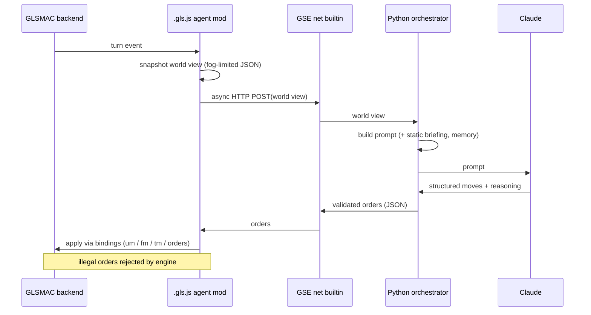

# Neural Amplifier — Vision

> An LLM brain for [GLSMAC](https://github.com/afwbkbc/glsmac). Neural Amplifier plugs
> Claude into the game so it can play a faction on its own **or** ride shotgun as a copilot
> for a human player — reasoning about strategy the way a person would, with every decision
> and every piece of context it saw fully inspectable.

**Status:** concept / pre-alpha. This document is the north star and the architecture we're
building toward, written honestly about what exists in GLSMAC today versus what we'll add.

---

## 1. What it is

Neural Amplifier is a bridge between GLSMAC — an open-source reimplementation of *Sid Meier's
Alpha Centauri* — and a large language model. Each turn, it hands Claude a compact,
fog-of-war-limited picture of the game and a menu of legal moves; Claude reasons about it and
returns orders; the game carries them out. The same loop runs in two modes:

- **Autonomous** — Neural Amplifier *is* the computer opponent, playing a faction end to end.
- **Copilot** — Neural Amplifier advises a human, proposing and annotating moves the player
  approves.

The name is the pitch: it takes the raw signal of the board and *amplifies* it into
strategy.

## 2. Why now

Two things line up:

1. **GLSMAC has no AI opponents yet.** Computer players and automation are on GLSMAC's own
   roadmap for a later version (~v0.7) and are not implemented today. There is a genuine,
   unfilled gap — but also nothing to piggyback on, so we build the decision layer from
   scratch.
2. **Strategic reasoning is exactly what LLMs are unexpectedly good at, and what 4X AI has
   always hard-coded badly.** Classic game AI leans on scripted heuristics and difficulty
   cheating. An LLM can weigh fuzzy, long-horizon tradeoffs ("expand toward the coast or
   fortify the ridge?") in natural language — and, crucially, *explain why*.

We're honest about the unproven parts: LLM latency against turn pace, per-turn token cost,
and whether the model plays *well* rather than merely legally. This vision is a bet worth
testing, not a solved problem.

## 3. What GLSMAC gives us (and doesn't)

Grounding, verified against the GLSMAC source (fork at `scbrown/glsmac`):

| Surface | Reality today |
|---|---|
| **Scripting engine (GSE)** | A JS-like `.gls.js` language (`src/gse/`). Game logic is progressively moving into scripts. Scripts hook events via `.on(...)` and call backend bindings. This is our integration home. |
| **Events** | Global: `start`, `configure`, `create_world`, `turn`, `error`, `message`. Manager-scoped via `.on(...)`: `um.on('unit_spawn' / 'unit_despawn' / 'unit_turn')`, `bm.on('base_spawn' / 'get_base_intake' / 'get_base_workable_tiles')`, plus `get_tile_resources`. The `turn` event is our heartbeat; **`unit_turn`** and the base/tile calc callbacks are natural per-entity injection points. |
| **Bindings (managers)** | `um` (units: `spawn_unit`, `define_unit`, …), `fm` (factions: `add`, `import_colors`, …), `tm` (map: `get_map_width/height`, `get_tile`, `get_distance`), `bm` (bases: `spawn_base`, `get_bases`, `define_pop`), `rm` (resources), plus `game.message(...)`, `game.get_players()`, `game.year`. |
| **Backend/frontend split** | `src/game/FrontendRequest.h` (backend→frontend state, ~33 events: `FR_UNIT_*`, `FR_BASE_*`, `FR_TURN_*`, …) and `src/game/BackendRequest.h` (frontend→backend, currently thin). A clean seam. |
| **The "sandbox"** | **An *absence* of IO builtins, not a security restriction.** Registered builtins are only `Async`, `Console`, `Conversions`, `Include`, `Math`, `Object`, `String`, `Common` — no network/socket/filesystem. Since GLSMAC is AGPL-3.0 and we compile our own build, we simply **add** one. |
| **No headless mode** | The engine is OpenGL/SDL2 render-driven. A bot backend needs a virtual framebuffer (Xvfb) or, eventually, a backend/renderer decoupling. |
| **TCP multiplayer** | Real (`src/network/`, `--host`/`--join`), but the wire protocol is custom, serialized C++ state, and undocumented. |
| **Injection hooks** | `--mainscript <file>`, `--worldscript <file>`, `--mods <list>`, plus quickstart flags (`--quickstart`, `--quickstart-faction`, `--quickstart-mapsize`, `--nosound`, `--windowed`). |

## 4. Design principles

- **The game stays authoritative.** The LLM *proposes*; GLSMAC *validates and executes*.
  Claude never mutates state directly — it picks from an engine-supplied action space, so an
  illegal or hallucinated order is simply rejected, not enacted.
- **Logic lives in scripts, not in a fork.** We keep our C++ footprint to a single, generic
  addition and put all Neural Amplifier *behavior* in `.gls.js`. Smaller surface, easier to
  track upstream, plausibly contributable back.
- **The turn is the loop.** Observe → decide → act, keyed to the `turn` event. Everything
  else is detail.
- **Never block the render loop.** The decision round-trip goes through GSE's `Async`
  builtin; a slow model degrades turn latency, never freezes the game.
- **Graceful degradation.** If the model is slow, over budget, or unreachable, the faction
  falls back to a safe default (hold position / end turn) rather than stalling.
- **No cheating.** The world view is fog-of-war-limited to what the faction can legitimately
  see. An LLM that reads the whole map isn't an opponent, it's an oracle.
- **Everything is inspectable.** Because context leaves the game as plain JSON over HTTP,
  every turn's input to Claude and Claude's reasoning back out can be logged, replayed, and
  audited.

## 5. Architecture — the "script-first bridge"

The chosen design: **a GSE HTTP/net builtin + a thin `.gls.js` agent mod + an external
Python orchestrator.**

- **Agent mod (`.gls.js`)** — subscribes to `turn` (and unit/base/faction events),
  snapshots the game into a compact JSON *world view*, sends it out, and applies the returned
  orders by calling backend bindings. Kept deliberately thin: gather → call → apply.
- **GSE HTTP/net builtin (the one C++ addition)** — gives scripts real outbound HTTP. This
  is what "removes the sandbox." Invoked via `Async` so the request never blocks rendering.
  It's a generically useful capability (mods that talk to services), so it's a candidate to
  upstream behind a flag.
- **Python orchestrator (Claude Agent SDK)** — owns everything LLM-shaped: prompt assembly,
  tool-use loops, retries, streaming, and API-key/secrets handling. It receives the world
  view, prompts Claude, and returns structured, validated moves. This is where the real
  intelligence-wrangling lives, in a language with mature tooling for it.



**Autonomous vs. copilot** is the same loop with a different sink for the orders: autonomous
applies them directly; copilot surfaces them to the human (via `game.message` / UI hooks) as
suggestions to approve, edit, or reject.

## 6. What Claude sees — the world-view context

This is the heart of the project, and it's meant to be looked at. The **best part of using
an LLM as the brain is that its entire input is legible** — no black box.

**The freebie: Claude already knows the game.** The factions (Gaians, Hive, University,
Morgan, Spartans, Believers, Peacekeepers, and the Crossfire additions), the tech tree,
social engineering, terraforming, secret projects, mind worms and fungus, the combat
model — all in training data. We don't teach the rules; we feed **state**, plus short notes
only where GLSMAC diverges from the original.

The context is assembled in four layers:

**Layer 1 — Static briefing (once per game, prompt-cached).** Rules and house-rules, the
faction roster and agendas, victory conditions, map size, difficulty. Cheap because it's
cached across every turn.

**Layer 2 — Per-turn world view (fog-limited JSON).** Snapshotted from the bindings:

- **Standing:** turn number, `game.year`, faction scores.
- **Map/tiles** (`game.tm`): terrain, altitude (land/sea), rockiness, resources
  (nutrients/minerals/energy), features (fungus, rivers, monoliths, bonuses), improvements
  (roads/farms/mines/solar/sensors), owner — **only tiles the faction can see.**
- **Own units** (`game.um`): id, type/chassis, position, HP, morale, moves left, orders.
- **Bases:** location, population, nutrient/mineral/energy yields, production queue,
  facilities, garrison.
- **Faction economy:** energy/credits, current research + progress, techs known, social
  engineering settings.
- **Visible others:** enemy/neutral units and bases within sight; diplomacy as it matures.
- **Deltas since last turn:** combat results, bases founded, techs discovered — so Claude
  reacts to *what changed*, not just a static board.

**Layer 3 — Action space.** The legal moves available *this* turn (move-to tiles, found
base, set production, set research, adjust SE, diplomacy). Claude chooses from an
engine-accepted menu — the anti-hallucination guardrail.

**Layer 4 — Memory.** Strategic notes Claude wrote in prior turns, persisted by the
orchestrator and fed back for continuity ("still pursuing a builder game; watching the Hive
to my east").

A sketch of the per-turn payload (illustrative, **`schema_version`-tagged and expected to
grow**):

```json
{
  "schema_version": "0.1",
  "turn": 42,
  "year": 2142,
  "faction": "GAIANS",
  "scores": { "GAIANS": 310, "HIVE": 288 },
  "economy": { "energy_credits": 74, "research": { "current": "Ecological Engineering", "progress": 0.6 },
               "social_engineering": { "economics": "Planned", "values": "Green" } },
  "map": { "width": 64, "height": 32,
           "visible_tiles": [ { "x": 12, "y": 8, "terrain": "rolling", "altitude": "land",
                                "resources": { "nutrients": 2, "minerals": 1, "energy": 0 },
                                "features": ["river"], "improvements": ["road"], "owner": "GAIANS" } ] },
  "units": [ { "id": 101, "type": "former", "x": 12, "y": 8, "hp": 10, "morale": "disciplined",
               "moves_left": 1, "orders": "idle" } ],
  "bases": [ { "name": "Gaia's Landing", "x": 11, "y": 9, "pop": 4,
               "yields": { "nutrients": 6, "minerals": 3, "energy": 5 },
               "producing": "Recycling Tanks", "garrison": [102] } ],
  "deltas": [ { "type": "tech_discovered", "tech": "Centauri Ecology" } ],
  "action_space": [ { "action": "move_unit", "unit": 101, "to": [13, 8] },
                    { "action": "found_base", "unit": 103, "at": [20, 14] },
                    { "action": "set_production", "base": "Gaia's Landing", "item": "Former" },
                    { "action": "end_turn" } ]
}
```

**Design constraints, stated honestly:**

- **Versioned schema.** We start from what bindings expose *today* (tiles, units with
  position/HP/morale, factions, turn, bases) and grow the payload as GLSMAC's v0.4–v0.7 work
  exposes production, research, and diplomacy. `schema_version` lets the orchestrator adapt.
- **Token budget.** A full fog-of-war map is large. We send visible-only tiles, prefer
  deltas over full snapshots, optionally include a compact ASCII/semantic map, and
  prompt-cache the static briefing.
- **Fog of war is sacred.** Never serialize what the faction can't see.

## 7. Alternatives considered

| Approach | Why not (or why not yet) |
|---|---|
| **Full in-script** — the `.gls.js` mod calls the Claude API directly, no external process | Cleanest topology, but reimplements prompt-building, tool-use loops, retries, streaming, and secrets management inside a young scripting language. Rejected in favor of the mature Python SDK. |
| **Narrow message-channel builtin** — one bespoke primitive to pass a world view out and get moves back | Smallest C++ change, but an HTTP builtin is more generally useful (and more upstreamable). Rejected as too special-purpose. |
| **External TCP bot-client** — speak GLSMAC's multiplayer protocol as a networked player | Conceptually clean ("just another client"), but the wire protocol is custom, undocumented, and unstable while multiplayer is young. High reverse-engineering cost. |
| **Heavy C++ fork / native backend module** — pipe state through a compiled bridge | Maximum control, but maximum maintenance and upstream drift. Overkill when one builtin + scripts suffice. |

**Chosen: net builtin + external Python.** Smallest durable C++ surface, all behavior in the
scripting layer GLSMAC already wants us to use, and LLM orchestration where the tooling is
best.

## 8. Roadmap

Each phase names concrete exit criteria and the risk it retires.

- **Phase 0 — Spike.** Build and run GLSMAC (`--quickstart`), confirm a mod's handler fires
  on the `turn` event, prototype the HTTP/net builtin (or a stopgap), and echo a
  *hand-written* move end to end through the loop.
  *Exit:* one scripted order round-trips mod → Python → mod → engine. *Retires:* "can we even
  reach out of the sandbox and act?"

- **Phase 1 — MVP loop.** Read-only world view → Claude → **one legal action per turn** for a
  single faction. Log every context payload and decision.
  *Exit:* Claude issues a legal, engine-accepted move each turn. *Retires:* "can the model
  consume our world view and choose validly?"

- **Phase 2 — Autonomous faction.** Full turn automation — units, bases, research as those
  bindings mature. Play a whole game unattended.
  *Exit:* a complete game finishes with the faction under LLM control. *Retires:* "does it
  play, not just move?"

- **Phase 3 — Copilot.** Human-in-the-loop: suggestions, annotations, approve/edit/reject via
  UI hooks.
  *Exit:* a human plays a game with live LLM advice. *Retires:* "is the reasoning useful to a
  person?"

- **Phase 4 — Depth & upstream.** Multiple factions, diplomacy, persistent strategy/memory.
  Propose the HTTP builtin (and any AI hooks) upstream; track GLSMAC's own v0.7 AI work and
  converge rather than compete.
  *Exit:* Neural Amplifier is a maintainable companion to mainline GLSMAC. *Retires:* "does
  this live alongside upstream, or fork away from it?"

## 9. Open questions & risks

- **Immature/undocumented order bindings.** High-level commands (found-base, move-to,
  set-research, diplomacy, end-turn) appear mid-implementation upstream. Our action space can
  only be as rich as what's exposed — the schema grows with GLSMAC.
- **No headless mode.** Running a bot backend needs Xvfb today, or an eventual
  backend/renderer decoupling. A real dependency for automated/long-running play.
- **Latency vs. turn pace.** A thinking model takes seconds; a game has many turns. Mitigated
  by `Async`, caching, and possibly smaller/faster models for routine turns.
- **Per-turn cost.** Tokens add up over a full game. Deltas, caching, and tiered model use
  are the levers.
- **Fork sync.** Even a one-builtin change must track a moving upstream.
- **AGPL-3.0 obligations.** Any distributed C++ changes carry the license's source
  requirements — a reason to keep the C++ surface small and upstream-friendly.
- **Play quality.** The open empirical question: legal ≠ good. We'll only know by watching it
  play.

## 10. References & glossary

- **GLSMAC** — the game engine. <https://github.com/afwbkbc/glsmac> (AGPL-3.0).
- **GLSMAC demo mod** — reference for mod layout and bindings.
  <https://github.com/afwbkbc/glsmac-demo-mod>
- **GSE** — GLSMAC Scripting Engine; the `.gls.js` interpreter in `src/gse/`.
- **`.gls.js`** — GSE's JavaScript-like scripting language (not GLSL/shaders).
- **Bindings** — C++ objects/methods exposed to scripts (`src/game/backend/Bindings.*`).
- **World view** — the per-turn JSON snapshot Neural Amplifier sends to Claude.
- **Action space** — the set of legal moves offered to Claude each turn.
- **SMAC** — *Sid Meier's Alpha Centauri* (+ *Alien Crossfire*), the game GLSMAC reimplements.
