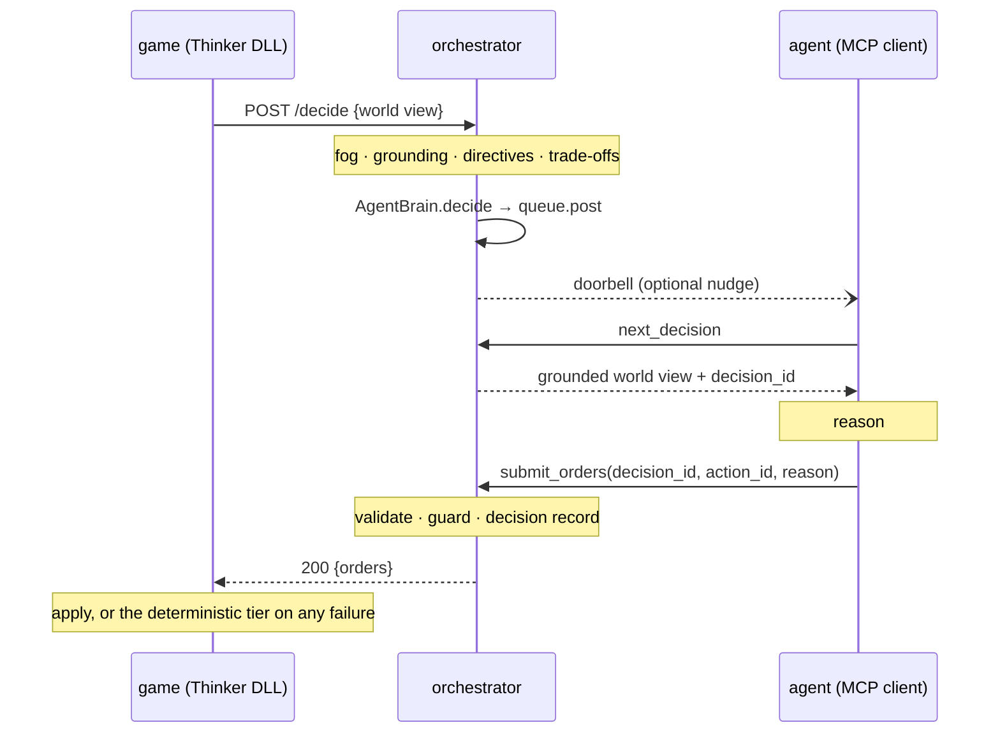

# Agent play — the brain as an attached harness

How an agent in a terminal — Claude Code, or anything else that speaks MCP — becomes the LLM
tier, and why that turned out to be a smaller change than it sounds.

Companion to [contract.md](contract.md), which this does not alter: an agent sees the same
world view and returns the same orders. What changes is *who calls whom*.

---

## 1. Inversion of control

Before, the orchestrator called a model:

```text
adapter --HTTP--> orchestrator --Agent SDK--> Claude
```

Now it serves a decision surface and something else comes and takes the work:

```text
adapter --HTTP--> orchestrator --MCP--> Claude Code (or any client)
```

The orchestrator stops *driving* and starts *offering*. That is the whole pivot, and it is one
class: `AgentBrain` parks the decision on a queue and blocks until somebody answers it.

**Why it is small.** `Orchestrator.decide` reaches a model on exactly one line. Everything else
it does — fog gating, grounding retrieval, directive trade-offs, action-space validation, the
policy guard, the decision record, telemetry — happens *around* that line. Twelve of the
thirteen orchestrator modules are invariant enforcement, not LLM plumbing. So swapping the
model for an agent does not need a second pipeline; it needs a different `Brain`.

The consequence worth stating plainly: **an agent is not a privileged client.** What it
receives is the fully grounded world view, because grounding happens before the brain is
called. What it sends goes through `validate()` and the guard, because that is what the
decision loop does with any brain's answer. An agent cannot name an action the engine did not
offer, and the thing that stops it is not in the agent.

## 2. How a decision travels



The game is blocked at the arrow that goes down the left-hand side, and that is intentional —
see §4.

## 3. Finding work: asking beats being told

There are two ways an agent learns a decision is open, and they are **not** equal.

| | How | Guarantee |
|---|---|---|
| **Poll** — the mechanism | `next_decision(wait_seconds=60)` blocks server-side until one arrives | Always works. No configuration, nothing to misconfigure |
| **Doorbell** — a convenience | orchestrator runs `tmux send-keys` at a pane named by `NA_TMUX_TARGET` | Best-effort. May be absent, may be silently lost |

**A harness must always be able to call in for open decisions.** That is the contract. The
doorbell only saves an agent from waiting; nothing may depend on it, because `send-keys` has no
error reporting to give — it types into a pane and cannot tell you whether anything read what
it typed. A notification channel that other things depend on stops being a notification channel
and becomes a single point of failure with no diagnostics.

Two further properties of the doorbell, both deliberate:

- **It carries no game data.** Base names are editable in-game and faction nouns come from a
  text file, so every name in a world view is player-supplied. A base called `"; rm -rf ~` is a
  legal SMAC base name. The nudge is a fixed sentence plus a decision id the orchestrator
  generated — the world view is collected over MCP, where it is data rather than keystrokes.
- **Nothing is ever launched.** Neural Amplifier does not start tmux, a pane, or an agent. It
  rings a pane that already exists, if it was told about one. Setting up the session is the
  agent's own job — see the `play-alpha-centauri` skill — and that is exactly what keeps a
  harness swappable. A new harness needs no integration work here, because there is no
  integration point to write: it attaches, and it asks.

## 4. Blocking, and what it costs

The game waits at a decision point until the agent answers. That is a deliberate relaxation of
[invariant 9](../AGENTS.md) ("the game never stalls waiting on the brain"), taken because a
turn-based game pausing at a decision point is what it already does for a human player — and
this mode exists precisely for when a human or an agent *is* playing.

Two escape hatches keep it from being a trap:

- **`NA_AGENT_TIMEOUT`** (orchestrator, seconds). Unset means wait forever. Set it for an
  unattended run and a silent agent degrades to the deterministic tier with a recorded reason
  instead of hanging the game.
- **`llm_timeout_ms`** (thinker.ini). Same idea one layer down; `0` means wait forever, which
  is the default.

**On the adapter side the wait is sliced, and it deliberately does not pump.** The obvious way
to keep a window alive while blocking is `PeekMessage(PM_REMOVE)` + `DispatchMessage`, and that
is wrong here: the DLL is inside `mod_base_build`, inside the engine's own base-processing
loop. Dispatching re-enters the window procedure, which runs `mod_blink_timer`, which runs the
autoload and command-channel ticks, which touch game state. Re-entering the engine from inside
a decision hook corrupts turns in ways that are near-impossible to reproduce.

So the wait calls `PeekMessage(PM_NOREMOVE)` and dispatches nothing. That is enough for the
only property needed — the thread has *touched* its queue, so Windows stops considering it
hung. The window does not repaint while a decision is outstanding. A stale window for a few
seconds is the right price for not mutating the board re-entrantly.

## 5. The tool surface

Four tools: the three moments of a decision, plus setting a plan that outlives the turn.

| Tool | For |
|---|---|
| `next_decision(wait_seconds)` | Collect the decision waiting for you, with its full world view |
| `submit_orders(decision_id, action_id, reason, cited, followed, overrode)` | Answer it, choosing from the action space |
| `decisions_waiting()` | What is outstanding — for re-orienting after a reconnect or compaction |
| `issue_directive(...)` | Set a standing plan later decisions will be shown. Call before submitting |

Anything more would invite the model to go looking for game state instead of reading the world
view it was handed, and there is no other source to look in.

**`cited`, `followed` and `overrode` are not optional decoration.** They are the measurement
channels: grounding utilisation, and directive attention. The agent pivot briefly zeroed all
three by accepting only an action id, which in a record is indistinguishable from a brain that
read twelve facts and a standing plan and ignored every one. The explanations live in the *tool
descriptions* rather than in a system prompt, because `Orders.cited` already records that
explaining it in a prompt left it empty on every run.

**Rejections are addressed to the model.** An id outside the action space comes back as a 422
carrying the legal set, so the agent can correct itself in the tool result it is already
reading. The orchestrator would strip an illegal choice anyway — but silently, and a model
cannot fix a mistake nobody reported. Answering twice is a 409; answering an abandoned decision
says so, rather than the indistinguishable "no such decision".

## 6. Running it

The orchestrator, with the agent brain:

```bash
NA_BRAIN=agent NA_DECISION_LOG=decisions.jsonl \
  uv run --directory orchestrator neural-amplifier serve
```

`GET /health` reports `"brain":"agent"`. The `/agent/*` endpoints exist **only** in this mode —
mounting them always would advertise a queue nothing fills, and an agent attached to a scripted
run would wait forever with no way to tell why.

The MCP server, attached to that service:

```bash
claude mcp add neural-amplifier -- \
  uv run --directory orchestrator neural-amplifier mcp --url http://127.0.0.1:8000
```

It talks to a *running* orchestrator over HTTP rather than importing it: one source of truth for
the queue, several agents able to attach at once, and an MCP process that can be restarted
without dropping a game.

Optional nudge — only if the agent already has a pane:

```bash
NA_TMUX_TARGET=smac:brain   # a pane the AGENT created, not one we create
```

## 7. Is the game still in the state the decision assumed?

Blocking made one staleness problem go away and created two others.

It went away *within* a decision: the engine is single-threaded and sitting in
`mod_base_build`, so while the agent thinks, nothing moves. The snapshot cannot drift.

The two that appeared:

1. **The adapter replays a cached decision.** `mod_base_build` fires roughly twice per base per
   turn and each call applies its own answer, so the adapter asks once (`call_seq == 1`) and
   replays. By the replay the engine has processed other bases, spent minerals, possibly
   finished a project. The item may no longer be buildable.
2. **The agent has a memory now.** A Claude Code session persists across a whole game, so it can
   carry a belief about a base from twenty turns ago and reason from that instead of the world
   view in front of it. A stateless model call could not do this — the failure mode is new,
   and it arrived with the inversion.

Two checks, at the two places the two problems live.

**In the adapter, before a replay.** `na_item_is_legal` re-runs the engine's own availability
tests. If the cached choice no longer passes, the deterministic tier's item runs — and a record
is written saying so, carrying `superseded_item` and a `fallback_reason`. A replay that applies
what was decided writes nothing (one decision, one record); a replay that *diverges* must,
because without it the log asserted "llm chose X, applied X" while the base quietly built
something else and nothing anywhere could tell you.

**In the orchestrator, at the guard seam.** `StateGuard` (`hank.py`) checks a chosen order
against the state it is about to be applied to:

- **Unaffordable is denied.** An action declaring `energy_reserves: -81` against a reported 82
  is fine; against 40 it is stripped. Still legal by the engine's list, no longer payable.
- **A violated directive is a warning, never a denial.** Priorities exist so a decision can
  *outrank* a plan; denying would make directives absolute, which the design explicitly rejects.
- **An unreported metric is uncheckable, never violated.** Inventing a baseline and denying a
  legal move on the strength of it turns a gap in the adapter into a wrong answer in the game.

### What this is not

It is not Hank. [policy-harness.md](policy-harness.md) describes roles (c), (d) and (e) — a hot
board graph, Quipu-governed gameplay policies evaluated against it, and speculative what-if — and
**none of it is built**. It is gated on Hank Phase 4 (Phase 3, multi-tenancy, has not started)
and on non-code fact ingestion that does not exist: every Hank node today anchors to a
`file:line` span, and a board node needs to anchor to a coordinate.

So `StateGuard` reasons only over numbers the world view already declares. That is less than
Hank will do and it is not nothing — every check is arithmetic on figures the adapter published,
so a denial is a fact rather than a guess. It sits behind the `Guard` protocol at the seam Hank
will occupy, composed by `GuardChain`, so the verdict shape and the record do not change when
the real thing lands.

## 8. When your order is refused: the repair loop

A denial used to cost the whole decision. The orders were stripped, nothing survived, and the
turn fell back to the deterministic tier — correct, but it gives up a turn one sentence of
feedback would have saved.

That cost nothing while the only guard was `CitationGuard`, which never denies. `StateGuard`
does, so it became real the moment §7 landed.

Now a decision whose every choice was thrown out is **re-asked once**, with the reason attached
in `world_view.advisories` — a contract field that existed for exactly this and had never been
set by anything.

```text
agent  submit_orders(hurry:now)
   ->  NOT applied — a repair decision follows; collect it and choose again
       advisories: hurry:now spends 81 energy_reserves but only 40 is available
agent  next_decision            -> the same surface, carrying that advisory
agent  submit_orders(hurry:none) -> applied to the game
game   degraded: false
```

Four properties worth keeping:

- **Bounded.** `NA_REPAIR_ATTEMPTS`, clamped to 0–2. `knowledge-architecture.md` allows two;
  the default is **one**, deliberately below that ceiling, because with an agent brain the game
  is *blocked* for each attempt — a repair is not a cheap retry, it is another round trip while
  a turn sits still. One catches the overwhelmingly common case, a single correctable mistake.
- **One decision, one record.** However many attempts it took. Two records would double-count
  the surface and make coverage read high while the game saw one build.
- **Violations still count.** `adherence_violations` accumulates across attempts. It is
  documented as structurally impossible, so any non-zero value is a broken invariant — a repair
  that quietly absorbed the first attempt's illegal ids would disable the one measurement
  designed to catch that. A corrected mistake is still a mistake; it just did not cost the turn.
- **A brain *error* is never repaired.** Repair is for a brain that answered badly. One that
  failed will fail again, and asking twice only doubles the delay before the fallback the game
  is waiting for.

## 9. What this does not change

- **The contract.** Same world view, same orders (`contract.md`).
- **Every invariant except 9.** The engine stays authoritative, the orchestrator still speaks
  only the contract, the adapter stays thin, surfaces still emit an id, handicaps are still
  declared.
- **The decision record.** An agent-answered decision is written to the same log with the same
  fields, so degrade rate, adherence and fair-play keep measuring the way the game is actually
  played. If that were not true, every measurement the project has would quietly stop covering
  the real thing.
- **Measurement.** `scripts/decision_stability.py` still drives the orchestrator directly, so
  N-run stability stays independent per sample. Agent play and measurement are separate lanes on
  purpose: an interactive session accumulates context, which is exactly what a stability sample
  must not do.

  `--brain claude-code` closes the gap between them. It runs the *same model the attached agent
  runs*, through `claude -p`, one fresh process per call — so the samples stay independent and
  it needs no API key, because it uses whatever credentials Claude Code already has. The
  `--brain claude` lane (Anthropic SDK, `NA_BRAIN=claude`) is still there and still the one with
  guaranteed-parseable structured output; `claude-code` asks for JSON and parses it, so it
  counts and reports its own malformed replies rather than hiding them.

  It also reports what it spent and how many directives were issued. A paid lane that does not
  report its cost invites a measurement nobody repeats, and an unreported zero is
  indistinguishable from a field nobody looked at — which is exactly how the first run of this
  measurement went wrong (see `na-43h`).
