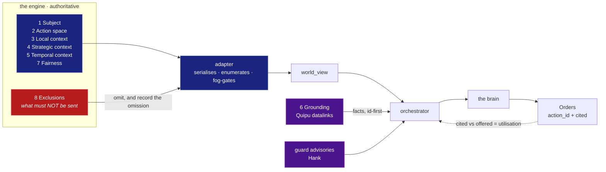

# Decision Inputs

What Claude needs to see, per decision, to decide well.

Companion to [game-surface.md](game-surface.md), which inventories *which* decisions exist and
assigns each a tier. This document answers the next question: for a decision on the LLM tier,
**what has to be in the world view before the answer can be any good?**

It exists because the failure it prevents is silent. A brain handed a bare list of legal options
will always return one of them, and the record will look identical whether the choice was
reasoned or guessed. You cannot tell a well-grounded decision from a coin flip by reading the
orders — only by auditing the inputs. So the inputs get a checklist.

This is a **living document**. Every surface we move to the LLM tier gets an entry, and entries
get refined as play shows what was missing. An entry is never "done"; it is current.

---

## 1. The checklist

Eight categories. Not every surface needs every one, but every surface should be *asked* about
every one — the point is to make an omission deliberate rather than accidental.

| # | Category | The question it answers | Who supplies it |
| --- | --- | --- | --- |
| 1 | **Subject** | What is deciding, and what state is it in? | Adapter |
| 2 | **Action space** | What may it legally do — *and what does each option cost and do?* | Adapter (engine-authoritative) |
| 3 | **Local context** | What is nearby that bears on this choice? | Adapter (fog-limited) |
| 4 | **Strategic context** | What is the faction trying to achieve, with what resources? | Adapter |
| 5 | **Temporal context** | What changed recently, and what is already in flight? | Adapter |
| 6 | **Grounding** | What do the rules actually say about these options? | Orchestrator (Quipu) |
| 7 | **Fairness** | Which handicaps are active right now? | Adapter (computed) |
| 8 | **Exclusions** | What must Claude *not* see? | Adapter (fog gate) |

Who supplies what, and where each part lands:



Categories 1–5 and 7 come from the engine through the adapter. Category 6 is the
*orchestrator's* — an adapter never sets `grounding`. Category 8 is the one that subtracts.

### 1.1 The two that get skipped, and why they matter most

**Category 2 is not "the list of legal moves."** A list of names is nearly useless: `Formers` vs
`Scout Patrol` is not a decidable comparison without cost, and a brain that cannot compare cost
will systematically over-pick expensive things. Every action needs at least **cost** and a
one-line **effect**. `Action` in [contract.md](contract.md) is `extra="allow"`, so this is
additive — no schema change required.

**Category 8 is a correctness requirement, not a nicety.** The temptation is to send everything
the engine knows, because more context reads as better decisions. But the engine knows things
this faction has not learned, and a brain that sees them will act on them — producing a player
that is subtly, unfalsifiably cheating. `fog.py` gates the diplomacy feed for exactly this
reason. **When in doubt, omit and record the omission** rather than send and hope the prompt
discourages use.

### 1.2 Cost discipline

Context is not free, and neither is latency. A decision that fires once per game can afford a
large world view; one that fires ten times per turn cannot. So each entry below records a
**budget** alongside its inputs, and a surface that fires often must justify every section.

The rule of thumb: **spend context where the decision is consequential and rare.** Tech choice
deserves a rich prompt. Per-base production, at ten bases a turn, does not.

---

## 2. `base.production` — what to build in a base

**Status:** first LLM-tier surface (A1). Fires per base per turn — *several times* per base per
turn at the engine level, gated to one decision by `call_seq == 1`
([headless-harness.md](headless-harness.md), and the `call_seq` rationale in
`thinker/src/neural.cpp`).

**Budget:** high frequency, low individual stakes. Keep it tight — this is the one surface where
terseness is a design goal.

| # | Category | Fields |
| --- | --- | --- |
| 1 | Subject | base name, id, coords; size (population); nutrient / mineral / energy surplus; minerals accumulated toward the current item; current item and turns remaining; drone and talent counts; facilities already built |
| 2 | Action space | every legal build, each with: `id`, display name, **mineral cost**, **`turns_if_switched` / `turns_if_continued`** (computed — see below), category (unit / facility / project), and a one-line **role** (units) or **effect** (facilities) |
| 3 | Local context | garrison strength in this base; visible hostile units within a few tiles; distance to the nearest known hostile base; whether this base is coastal |
| 4 | Strategic context | faction energy reserve; base count; tech currently researched; social-engineering settings; who we are at war with |
| 5 | Temporal context | `history` — what this base built in the last few turns, each with the `tier` that chose it (**built**, see below) |
| 6 | Grounding | from `alphax.txt` via Quipu: what each offered facility/unit actually does, at **canonical** tier — never a mod's stats presented as canonical |
| 7 | Fairness | the active handicap ledger for this faction |
| 8 | Exclusions | anything outside this faction's fog; other factions' production; unmet factions' existence |

### Temporal context works, and is not an anchor (na-61c.2)

Production is re-decided every turn, so a stateless brain re-argues the case from nothing each
time: every choice defensible, the sequence accumulating nothing. `WorldView.history` is the fix
— a short ring buffer per base, oldest first, each entry carrying the `tier` that made it.

This was worth checking before building, because the case weakened once decision instability was
measured properly. A stable decision cannot demonstrate anything (history can only fail to help
a choice already made unanimously), so the check used a **contested** one: the same
`base.production` world view grounded with four facts splits three ways. Ten runs per arm on
Haiku, with history naming the option the brain picks *least* often — the version that can fail:

| arm | continued the prior choice |
| --- | --- |
| no history | 0.30 |
| + three turns of `llm` history | **1.00** |
| + history, but the case changed | **0.10** |

The third arm is the one that makes the other two mean anything. History alone cannot separate
"correctly continued" from "anchored regardless" — nothing in that world view argued for
switching, so continuing was right by construction. So the third arm changes the case: drones
triple and a priority-8 directive caps them, which the history's item does not address and
another option does. The brain abandons its own history 9 times in 10.

So history buys continuity without buying deference. The `tier` field is what keeps that true at
the other end: a `deterministic` entry is a default to improve on, not a decision to respect, and
collapsing the two would have the brain defer to a choice nobody made.

**Still outstanding.** This is ten independent samples of one synthetic re-decision, not ten
consecutive turns of a real game, which is what the bead's acceptance criterion asks for and what
would actually show a base finishing what it starts. The `changed` arm also moves two things at
once (the metric and the directive), so it shows the brain will switch when the case changes
without saying which change did it.

### The wire was missing under all of it (na-wzw)

The result above was obtained by setting `history` directly on a synthetic world view. **No live
game could produce one.** The adapter emitted the block as `recent_builds`, newest first, with
`item` as a raw engine int; the contract declared `history`, oldest first, `item` a string.
Nothing mapped between them, so `WorldView.history` was `None` on every real decision and the
system prompt's continuity guidance gated on a field that never arrived.

Nothing failed, which is why it survived. `WorldView` allows extras and the whole payload reaches
the prompt, so the block *was* in front of the model — unexplained, and in the opposite order to
the one the prompt described. A model applying the documented reading to the undocumented field
takes the **oldest** entry for the most recent choice. That is worse than omitting it, and it is
the na-eaa failure exactly: state handed over correctly and misread — the same run that invented
"18/33 minerals done" against a world view saying 4.

Fixed adapter-side, because the contract is what both engines must speak and GLSMAC will need the
same field. Two things came out of checking it against a live game rather than a fixture:

- **`tier: "probe"`** was emitted by the old writer and is not in `PriorChoice`'s literal. No call
  site ever wrote it, but had one started, the world view would have been rejected whole rather
  than losing one field. Unattributable entries now emit `null`, which is what the contract means
  by "this adapter does not track authorship".
- **History contained the current turn** on `call_seq >= 2`. The first call of a base-turn records
  its choice, so later calls serialised a history holding the answer to the question they were
  asking (measured: Zoloto-Gold turn 36, seq 2). The brain never saw it — seq ≥ 2 is served from
  the per-turn cache — but `decision_stability.py` re-decides the **last** row for a surface, so
  it would have handed the brain its own prior answer as history and scored the resulting
  agreement as stability.

The general lesson is the one worth keeping: **a fixture written to match the contract cannot
catch an adapter that does not.** Both sides of this were tested and both passed.
[`scripts/check_live_world_view.py`](https://github.com/scbrown/NeuralAmplifier/blob/main/scripts/check_live_world_view.py)
parses a real capture and reports which typed fields are actually populated, which is the check
that was missing.

**Measured stability, five identical prompts.** 4 of 5 chose Colony Pod, 1 chose Formers —
`stability 0.80`, `utilisation 0.20`. Both choices were legal and defensible. That is low enough
to matter on a decision re-evaluated every turn and high enough that the earlier alarm about
oscillation was overstated: an uncontrolled pair of disagreeing runs turned out to be this same
one-in-five, not evidence of a coin flip. Run it with
[`scripts/decision_stability.py`](https://github.com/scbrown/NeuralAmplifier/blob/main/scripts/decision_stability.py).

**Why category 5 is on this list.** Production decisions are re-evaluated constantly, and a
stateless brain will happily flip between two options every turn, accumulating nothing. Recent
history is what makes a *stable* choice possible.

**Reversed after measurement.** This entry originally said: ship cost and accumulated minerals,
let the brain divide, and do not pre-compute a figure that will be subtly wrong for a
partially-built item. That was defensible in theory and wrong in practice. Across two runs on the
*same* world view, a model computed `(33-4)/2` correctly once and then `22/2` the next time,
silently dropping the 4 banked minerals it had just used. An arithmetic slip in the input to a
strategic judgement is worse than a documented approximation.

So the adapter computes turns, and ships **two separately named numbers** rather than one
ambiguous `turns`:

| Field | Meaning |
| --- | --- |
| `turns_if_switched` | `ceil(cost / surplus)`, ignoring the bank — switching item category forfeits progress, so this is the conservative and usually correct read |
| `turns_if_continued` | only on the item currently in production, where the bank does apply |

A single `turns` field would have to pick one meaning and would be wrong half the time.
`surplus <= 0` yields `null`, which is honest: a base with no mineral surplus cannot finish
anything.

**Confirmed a second way, and more strongly than intended.** Across five byte-identical prompts,
one run asserted *"nearly-complete Colony Pod (18/33 minerals done)"* — the world view said
`minerals_accumulated: 4`. It fabricated a state value it had been handed correctly. **And it still
decided correctly**, because it took `turns_if_continued: 15` from the field rather than deriving
it.

So a precomputed field does not only guard against bad arithmetic, which is why it was added. It
also **contains a misread input**: the error stayed in the prose and never reached the choice.
A world view that makes the brain derive things is one where a misreading propagates into the
decision instead of stopping at the narration.

The general lesson: **do not hand a model arithmetic you can do exactly.** The reason to prefer
raw inputs is auditability, and that argument loses to a model that gets the sum wrong half the
time on identical input.

### 2.1 What was actually missing — verified against live play, 2026-07-29

This is step 5 of §6 done for real, and it is the most useful part of the entry. **Both
action-space fields were wrong on the first implementation, and neither error was visible in code
review.** Only a running game exposed them.

**The availability predicate was not an availability predicate.** `can_build_unit` / `can_build`
look like the right tests and are not: they check proto-slot ownership, the colony/nutrient rule,
sea adjacency and the unit cap, and **never check whether the prerequisite tech is known**. The
result was **125 options** offered for a turn-35 base, including *Alien Artifact*, which cannot be
built at all. The engine's own tests are `mod_veh_avail` and `mod_facility_avail`; with those the
same base offers **8**, matching the game's own build menu.

The general lesson: *a predicate whose name matches your intent is not evidence it implements your
intent.* Find what the engine's own UI calls, and call that.

**Cost was in the wrong unit, silently.** The engine stores item cost in "rows"; minerals is
`cost * cost_factor`, and that factor varies by faction and difficulty. Base state reports
`minerals_accumulated` in raw minerals, so the world view was mixing two units in one object.
Colony Pod `cost: 3` next to `minerals_accumulated: 4` reads as *nearly affordable* and is
actually 33 against 4 — the brain would have done confident arithmetic on incompatible numbers
and produced fluent nonsense. Now normalised through `mod_cost_factor` and tagged
`cost_unit: "minerals"` so the unit is explicit rather than assumed.

The general lesson: **state the unit in the payload.** Two numbers in different units are worse
than one number missing, because nothing downstream can detect the problem.

Verified output, Gaia's Landing, turn 35 — 8 actions, costs in minerals, effects from
`alphax.txt`:

```text
unit:0      Colony Pod                 33
unit:1      Formers                    22
unit:2      Scout Patrol               11
unit:64     Synthmetal Garrison        33
facility:3  Recycling Tanks            44   Bonus Resources
facility:6  Recreation Commons         44   Fewer Drones
facility:70 The Human Genome Project  220   +1 Talent Each Base
facility:72 The Weather Paradigm      220   Terraform Rate +50%
```

**How to verify a new surface cheaply.** In-game input cannot be driven (see
[headless-harness.md](headless-harness.md) §3.0.2), so turns cannot be ended on demand. Instead
the fork exposes `observe <base_id>` on the command channel: it emits one observation by calling
only the serialiser, never the decision function, so it has no side effects on a live game. Any
new surface should ship an equivalent side-effect-free probe — otherwise verifying it means
playing until it happens to fire.

---

## 3. `tech.choose` — which technology to research

**Status:** not yet implemented. Recommended as the **second** LLM-tier surface, and the first
where Claude should be expected to *outperform* the deterministic tier rather than merely match
it.

**Budget:** fires once per tech completion — every five to ten turns. Affordably rich. This is
where to spend context.

| # | Category | Fields |
| --- | --- | --- |
| 1 | Subject | the faction: current techs known, research output per turn, accumulated research |
| 2 | Action space | each researchable tech: `id`, name, **cost in research points**, turns at current output, what it unlocks (units, facilities, projects, SE options) |
| 3 | Local context | n/a — this is a faction-level decision |
| 4 | Strategic context | faction agenda and character; SE settings and what we would *like* to adopt; military position; economic position; known rivals' apparent tech level |
| 5 | Temporal context | the last several techs chosen — a path, not a point. This is the whole reason the surface suits an LLM |
| 6 | Grounding | the tech tree from `alphax.txt`: prerequisites, and the full unlock set two steps out |
| 7 | Fairness | tech-cost handicaps, which differ by difficulty and by slot |
| 8 | Exclusions | rivals' exact tech holdings unless legitimately known |

**Why this is the surface that justifies the project.** Thinker picks techs with weighted tables.
It cannot reason "we are Gaians, we are boxed in on a small continent, and a naval-plus-ecology
path suits both our character and our terrain." That is a *path* argument over many turns, and it
is exactly what a language model is good at and a weight table is not.

---

## 4. `social.engineering` — choosing SE values

**Status:** not yet implemented. Strong LLM fit; low frequency.

| # | Category | Fields |
| --- | --- | --- |
| 1 | Subject | current SE settings and the resulting effect totals |
| 2 | Action space | each legal SE combination, with its **net effect deltas** and any unlock requirement |
| 3 | Local context | drone/talent balance across bases — the constraint that usually binds |
| 4 | Strategic context | faction character and agenda; war or peace; growth vs military priority |
| 5 | Temporal context | previous SE choice and when it changed; pending revolt risk |
| 6 | Grounding | the SE table from `alphax.txt`, including faction-specific bonuses and prohibitions |
| 7 | Fairness | SE-related handicaps |
| 8 | Exclusions | other factions' SE settings unless known through contact |

**Note the faction-prohibition trap.** Factions are *forbidden* certain SE values. That is a rule
in `alphax.txt`, so it belongs in grounding — but it must **also** be enforced in the action
space, because grounding advises and the action space binds. An option Claude must not pick
should not be offered.

---

## 5. `unit.move` — where to move a unit

**Status:** deliberately **deterministic tier**, and this entry exists to record *why* rather
than to specify inputs.

Volume makes it unsuitable: dozens of units, every turn, each needing local terrain and threat
context. The token cost is enormous, the per-decision stakes are tiny, and Thinker's movement AI
is genuinely strong. It is also the surface where latency would be felt most — a turn cannot wait
on dozens of sequential model calls.

**If it is ever revisited,** the unit of decision should be an *operation* ("take that base",
"screen this approach") that the deterministic tier then executes, not individual tile moves.
That keeps the LLM at the altitude where it has an advantage.

---

## 6. Adding an entry

When a surface moves to the LLM tier:

1. Walk all eight categories. Write "n/a" with a reason rather than leaving a blank — a blank is
   indistinguishable from an oversight.
2. State the **budget** before the fields. Frequency drives everything else.
3. Name the **exclusions explicitly**. If the answer is "nothing", say so and say why.
4. Record **known gaps** at the bottom. A gap that is written down is a task; a gap that is not
   is a bug waiting to be misdiagnosed as a bad model.
5. After real play, come back and record **what was actually missing.** This is the step that
   makes the document worth keeping, and the one most likely to be skipped.
