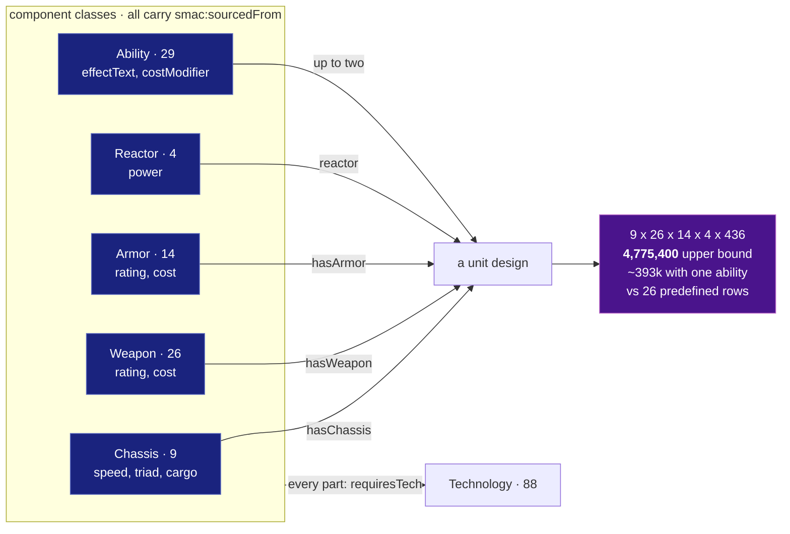
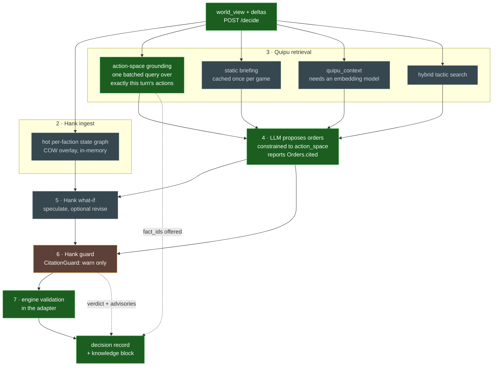

# Knowledge & Guardrails Architecture

> **Status: design / architecture (pre-alpha).** This document is the north star for wiring
> two sibling services — [Quipu](https://github.com/scbrown/quipu) (a governed bitemporal
> knowledge graph) and [Hank](https://github.com/scbrown/hank) (an in-memory graph + analysis
> engine) — into Neural Amplifier as **knowledge sources** and **guardrails**. No orchestrator
> code exists yet; this is the shape we build toward. It is written honestly about what is
> designed here versus what is net-new engineering or blocked upstream.

## Why this exists

Today [VISION.md](../VISION.md) §2 says *"We feed state, not the rules — Claude already knows
SMAC."* This architecture **evolves** that stance. Claude knows *Sid Meier's Alpha Centauri*
broadly from training, but that is not enough to play *well* over a long horizon: it doesn't
distinguish canonical SMAC from a Thinker house-rule or a GLSMAC deviation, it can't cite how a
specific engine actually scores a decision, and it forgets everything between games. So we add a
governed knowledge layer that:

1. **Grounds** engine-specific mechanics (from the real `alphax.txt` data and, via Hank, the
   engine source) so a house-rule can never masquerade as canonical.
2. **Guards** the agent's moves against strategic policies and invariants — beyond the engine's
   legality check.
3. **Remembers** — accumulates learned strategy, tactics, and opponent patterns across games.

The engine stays authoritative: the [contract](contract.md)'s `action_space` remains the hard
legality gate. The knowledge layer only *annotates, constrains, and informs* legal play — it
never invents actions.

## Three knowledge planes, one Quipu graph

- **Datalinks plane** — static, canonical SMAC rules from `alphax.txt` (+ encyclopedia prose).
  Ground truth, slow-changing. Class-heavy RDF with SHACL as the guardrail.
- **Doctrine plane** — curated *expert* strategy from the community (unit designs, base build
  orders, secret-project priorities): how to *use* the rules well. A prior, not law. Its own
  `strat:` namespace and `ruleTier "doctrine"`. See [strategy-knowledge.md](strategy-knowledge.md).
- **Memory plane** — bitemporal per-game and cross-game learned strategy. Fast-changing,
  episode-heavy, valid-time-versioned.

All live in one Quipu graph, distinguished by class, `group_id`, and a **mandatory engine+tier
tag** on every fact. The planes compose: rules ground doctrine, doctrine seeds play, and learned
memory refines and can override doctrine as its confidence grows.

## The Quipu SMAC ontology

A new `smac:` namespace (`http://neuralamplifier.local/ontology/smac/`), kept **distinct** from
Hank's code identity `bobbin:` (`http://aegis.gastown.local/ontology/`) — SMAC *rules* are a
different domain than *code structure*. The two planes join deliberately at one predicate,
`smac:computedBy → bobbin:CodeSymbol` (the Hank grounding bridge, below). Governance atoms reuse
`aegis:` (`Policy`/`Selector`/`Predicate`/`Verdict`) unchanged.

Core classes, and the `alphax.txt` section each is parsed from:

| Class | Key predicates | `alphax.txt` section |
|---|---|---|
| `smac:Technology` | `abbrev`, `aiWeight{Growth,Tech,Wealth,Power}`, `requiresTech` (0..2 → **the tech graph**), `flags` | `#TECHNOLOGY` |
| `smac:Chassis`/`Reactor`/`Weapon`/`Armor`/`Ability` | component stats, `cost`, `requiresTech` | `#CHASSIS`…`#ABILITIES` |
| `smac:UnitProto` | `hasChassis`/`hasReactor`/`hasWeapon`/`hasArmor`/`hasAbility`, `isPredefined` | `#UNITS` |
| `smac:Facility` | `cost`, `maintenance`, `requiresTech`, `obsoletedBy`, `effectText`, `computedBy` | `#FACILITIES` |
| `smac:SecretProject` ⊂ `Facility` | `aiPriority{Fight,Power,Tech,Wealth,Growth}` (the 5 SP ints) | `#FACILITIES` (SP rows) |
| `smac:SocialCategory`/`SocialChoice`/`SocialEffect`/`SocialLadderRung` | `inCategory`, `requiresTech`, `affectsModel`, `delta`, `level` | `#SOCIO`, `#SOCECONOMY`…`#SOCRESEARCH` |
| `smac:Terrain`/`TerraformAction` | `baseYields`, `altitudeBand`, `actionYieldDelta`, `requiresTech` | `#TERRAIN`, `#RESOURCEINFO` |
| `smac:Faction` | `agenda`, `socialPreference`, `socialAversion`, `startingBonus` | `#FACTIONS`/`#NEWFACTIONS` |

The `smac:requiresTech` edges across every class **are the full dependency graph** — "what
unlocks X" / "cheapest path to Fusion" become SPARQL property paths (`smac:requiresTech+`), and
"if I skip Ecology, what do I lose" becomes a `quipu_impact remove=true` counterfactual.

### The anti-masquerade guardrail

Every rule fact **must** carry three provenance predicates; SHACL refuses any that lack them:

- `smac:appliesToEngine ∈ {smac, thinker, glsmac}` — which engine this rule is true for.
- `smac:ruleTier ∈ {canonical, house-rule, engine-observed, aspirational}` — canonical = stock
  `alphax.txt`; house-rule = Thinker overrides; engine-observed = Hank-promoted from engine C++;
  aspirational = a GLSMAC system that doesn't exist yet (marked loudly).
- `smac:sourcedFrom` (IRI) — a datalinks section node **or** a Hank-promoted `bobbin:CodeSymbol`.

Retrieval always filters `appliesToEngine ∈ {smac, <current engine>}`, so a GLSMAC-only or
deviating rule can never surface in a Thinker game as canonical SMAC. Overrides use bitemporal
`quipu_set` + an explicit `smac:supersedes` edge, so time-travel still shows the canonical value
and the diff is auditable. Per-engine `group_id`s (`datalinks:{smac,thinker,glsmac}`) allow clean
bulk re-sync. The posture mirrors Quipu's `code-entities.ttl` and Hank's `code-edges.ttl`:
**permissive on domain shape, strict on the provenance/tier predicates** — the tag is the reader's
only signal of trust.

### The unit design space, as modelled

The predefined `#UNITS` list is 26 rows. What the rules permit is a *composition*, which is why
the parts are first-class nodes rather than string literals on a design:

`smac:hasChassis chas:infantry` is a hop to speed, triad and prerequisite tech. The literal
`"Infantry"` it replaced was a dead end.

## The learned-memory model

Learned knowledge is written via `quipu_episode` (structured nodes/edges + provenance +
auto-embed + entity-resolution), never as free Turtle, so every fact gets `prov:wasGeneratedBy`
for free. Vocabulary (`mem:` sub-namespace):

- `mem:Game` — one match (engine, faction, difficulty, seed, opponents, outcome).
- `mem:GameState` — a periodic turn snapshot for time-anchored recall.
- `mem:Decision` — a `/decide` call: chosen `action_id`s + reasons + turn.
- `mem:Tactic` — a learned pattern ("rush Recycling Tanks before size-3 on high-rocky starts";
  trigger, action, confidence).
- `mem:OpponentPattern` — observed opponent behavior (edges `aboutFaction`, `counteredBy`).
- `mem:Outcome` — result of applying a tactic (`confirmedBy`/`refutedBy` adjusts confidence).

**Bitemporal split:** `group_id memory:game:<id>` uses valid-time = in-game turn (recall "what
did I know at turn 30 of *this* game"; archived at game end). `group_id memory:durable` uses
wall-clock valid-time with confidence that rises/falls across games (recall "N games ago").
Transaction-time records *when we learned it*; valid-time records *which game-world it was true
in*.

This **reconciles the contract's `memory` field**: `notes` becomes a volatile *extraction buffer*
distilled into `mem:` episodes each turn; the `memory` injected next turn is **synthesized by
Quipu retrieval**, not carried verbatim. The wire format stays backward-compatible.

## Hank's five roles

Hank evolves from a code analyzer into the fast, in-memory tactical + guardrail engine on the
live board:

- **(a) Engine-mechanics grounding.** `hank_analyze`/`hank_symbols`/`hank_callers` over the
  Thinker/GLSMAC C++ scoring functions (`plan.cpp`, `build.cpp`, `tech.cpp`, `move.cpp`,
  `veh_combat.cpp`) → `hank_promote` → Quipu. A rule's `smac:computedBy` points at the promoted
  `bobbin:CodeSymbol`, so "how the engine *actually* scores this" is a graph hop, with Hank's
  `tier` carried through as `engine-observed`. Re-sync on engine change; bitemporal keeps the old
  belief time-travelable.
- **(b) Dev-time guardrail on the orchestrator's own code.** Quipu holds canonical `aegis:Policy`
  rows (tree-sitter selectors); Hank projects and enforces them at `hank hook pre-edit`;
  `hank_verify`/`hank_impact` guard edits to the contract/retrieval code. Reuses the existing
  policy mechanism.
- **(c) Gameplay policy-guardrail harness (net-new).** Evaluate Quipu-governed strategic and
  house-rule policies against **live game state + proposed orders**, reusing the
  `aegis:Policy/Selector/Predicate` atoms and Hank's `rules::Rule` field shape 1:1 (matchType,
  gate, effect warn|deny, claim/targets). New: `selectorLang ∈ {tree-sitter, graph-pattern,
  sparql}`, a compact **graph-pattern** selector over the state graph (Hank is *not* a SPARQL
  store — full SPARQL stays Quipu's job), `boundary "order"`, `tier "game-state"`. New surface
  `hank_guard` (MCP) + `POST /guard`: `{game_state, proposed_orders, tenant} → {violations[],
  advisories[]}`. It **complements, never replaces** `action_space`: legality is the engine's; the
  guard only subtracts or annotates *legal* orders. Example policies: garrison-border-bases,
  don't-break-a-pact-without-casus-belli, hold-expansion-under-threat, don't-trade-a-tech-that-
  unlocks-the-leader's-win.
- **(d) Hot in-memory game-state graph (net-new).** Hank holds the per-faction/per-game board
  graph in memory (copy-on-write overlays, its existing strength), rebuilt/patched each turn from
  `world_view` + deltas. Requires **generic non-code fact ingestion** (`hank_ingest`/`POST
  /ingest` mirroring `quipu_episode` JSON, or a `world_view`→graph adapter), a `Node/Edge` type
  not tied to source spans, `tier "engine-state"`, a `game-state` Cargo feature.
- **(e) What-if / impact over the live board (net-new).** Generalize `hank_impact` (code
  blast-radius) to the state graph: speculatively apply a proposed order-set to a COW overlay and
  compute downstream consequences (bases exposed, units entering threat range, reachability/ZOC/
  supply shifts, the opponent's next-turn reach) **without committing**. Surface `hank_whatif` (or
  a `speculate` flag on the guard). Contrast: Hank what-if = ephemeral live board, fast, this-turn,
  tactical; Quipu `quipu_impact remove=true` = persisted knowledge, durable, cross-game.

## Hot (Hank) vs persisted (Quipu) split

| Concern | Hank (hot / ephemeral) | Quipu (persisted / durable) |
|---|---|---|
| Live board graph (units/bases/tiles) | ✅ per-turn COW overlay | end-of-game snapshots only |
| Per-turn policy-guard + what-if | ✅ `hank_guard`/`hank_whatif` | authors/stores the policies |
| Static datalinks KB | read-cache (projected) | ✅ canonical store |
| Learned bitemporal memory | ✖ | ✅ `mem:` facts, valid-time |
| Canonical policies (`aegis:Policy`) | read-cache (projected) | ✅ governed source of truth |
| Provenance / audit / time-travel | ✖ | ✅ transaction + valid time |

**Sync:** (i) Quipu→Hank projection of policies + referenced datalinks (the existing
policy-projection path, generalized) so the harness evaluates without per-check round-trips; (ii)
Hank→Quipu promotion (`hank_promote`) of end-of-game learned state as durable `mem:` facts.

## Tenancy & isolation (representing opponents)

A game may host **several LLM-driven factions** (autonomous opponents), plus copilot mode
(human + brain share one faction). Each faction brain is a **principal** whose private state,
memory, and reasoning must be isolated **at least as strictly as in-game fog-of-war** — a
principal must never read a sibling's hidden intel, private memory, or plans. Tenancy is a
security boundary, not just organization.

- **Tenant keys:** hot state + per-game memory → `(game_id, faction_id)`; durable cross-game
  learned memory → a persistent `player_identity` (an "NA-Gaians book"), independent of any one
  game; datalinks + canonical policies → **global, read-only, shared by all**.
- **Hank gives fog isolation for free.** Shared **base graph** = public / common-knowledge facts
  (map size, public treaties, tech known to ≥3, observed sightings); per-faction **COW overlay** =
  that faction's private intel (own units/bases, unexplored fog, plans). This *is* Hank's
  shared-base + per-tenant-overlay architecture — a tenant reads the shared base + its own overlay,
  never a sibling's. `hank_ingest`/`hank_guard`/`hank_whatif` operate strictly within
  `(game_id, faction_id)`.
- **Quipu — and the honest limit.** Datalinks = shared read-only. Memory is scoped per principal,
  **but Quipu `group_id` is best-effort provenance, NOT an isolation boundary** — it cannot stop a
  crafted SPARQL query from reading a sibling's memory. So each persistent `player_identity` gets
  its **own Quipu database** for durable memory (true isolation — cheap given Quipu's "SQLite
  energy"), with a shared **read-only datalinks db** mounted alongside; `group_id` organizes
  *within* a principal, never across. Do not present `group_id` as a security boundary.
- **Opponent modeling.** "My dossier on the Hive" is a `mem:OpponentPattern` in *my* store, never
  the Hive-brain's own memory. If the opponent is also a Neural Amplifier brain, it is a separate
  principal with a separate store, and the **game engine is the only legitimate channel** between
  them (via each one's fog-limited `world_view`).
- **Fog honesty.** On Thinker, fog is real → fair. On GLSMAC today `fog:false` (full ground
  truth) → the knowledge-layer isolation boundary is *correct*, but the upstream `world_view`
  input is unfair until GLSMAC has fog.

## Retrieval + guardrail flow at `/decide`

Hank bookends the turn: it ingests the board before retrieval and guards the orders after the LLM.

1. `world_view` + deltas arrive at `/decide`.
2. **Hank ingests** → hot per-faction state graph (COW overlay; in-memory, no round-trip).
3. **Quipu retrieval annotates the prompt:** a cached-once static briefing (engine-filtered
   datalinks digest + opponent dossiers, prompt-cached at game start) + per-turn `quipu_context`
   (situation string → ranked facts) + action-space grounding (one batched SPARQL query
   over exactly the items in this turn's `action_space`) + `quipu_hybrid_search` tactics (k≈3,
   confidence-gated).
4. **LLM proposes orders** (already constrained to `action_space`).
5. **Hank what-if** on the top candidate(s) → surface consequences to the model for an optional
   revise.
6. **Hank guard** on the proposed orders over a COW overlay → deny-violations stripped and
   returned for bounded repair (≤2 retries, then `end_turn`); warn-violations become tier-tagged
   advisories.
7. Surviving orders → the adapter (which still runs engine validation — belt and suspenders).

**Precedence** the prompt and guard enforce: engine legality (`action_space`) > Hank
deny-policies > canonical datalinks > engine-observed (Hank-promoted) > house-rule >
`strat:` doctrine > learned tactic (a learned tactic is promoted above the doctrine it
contradicts once its confidence crosses threshold). **Budget discipline:** the static briefing
is cached and paid once; per-turn calls are
bounded to action-space scope; under budget, drop tactics before rules (rules are correctness,
tactics are optimization); bound deny-repair retries.

The flow, with what actually runs today marked:

Green runs. Amber runs partially — the guard exists with exactly one policy. Dashed is not built:
everything in that state either needs Hank's hot state graph or an embedding model.

### What is wired today

Steps 1, 3 (action-space grounding only), 6 (one policy) and 7 run. Steps 2, 5 and the rest of
3 do not — Hank's hot state graph is unbuilt, so nothing that reasons over the board can exist
yet.

| Step | State |
|---|---|
| Quipu action-space grounding | **Working.** One batched query over exactly this turn's `action_space` |
| Static briefing, `quipu_context`, hybrid tactics | Not wired. `quipu_context` additionally needs an embedding model |
| Hank ingest / what-if | Not built (roles d, e) |
| Hank guard | **One policy:** `CitationGuard`, verdict `warn` only |
| Engine validation behind it | **Working**, and it is what makes an illegal order impossible |

**Grounding is measured, not assumed.** A knowledge layer that quietly stops being consulted
looks exactly like a quiet day, so the record separates states that are easy to conflate:

- `quipu_absent` — no retriever configured, as distinct from `quipu_degraded` (configured and
  failed) and `quipu_hits == 0` (ran, found nothing).
- `hank_absent` — no guard wired, as distinct from a guard that allowed. Both produce an allow;
  only one is a deployment problem.
- `quipu_facts` / `quipu_cited` / `utilisation` — what was offered, what the brain said it used,
  and the ratio. `quipu_hits` counts what was *offered*; without citations, twelve facts
  retrieved and all ignored is indistinguishable from twelve that drove the decision.

Facts are injected **id-first** (`unit:formers Formers; terraforms terrain`) because the brain
cannot cite what it cannot see, and the id is the node's own IRI — so a citation resolves back
into the graph and to `smac:sourcedFrom`. Citations are filtered against what was actually
offered: a model naming a fact nobody gave it is a hallucination, and laundering that into the
provenance block would make the record assert that something informed a decision when nothing
did.

First measured utilisation, Haiku on a real turn-35 base-production decision: **1 of 7 facts
cited**. Six were paid for and unread — which is a retrieval-tuning signal that did not exist
before the instrumentation.

> **Quipu's SPARQL engine implements neither `VALUES` nor `FILTER(?x IN (…))`, and also rejects
> `FILTER NOT EXISTS`.** The third was found writing a provenance-completeness check ("which
> typed nodes lack `smac:sourcedFrom`"), and it means negation-shaped questions have to be
> computed client-side. All three are the same request: a way to express "not in this set". Both return
> `unsupported graph pattern` / `unsupported FILTER expression` (verified against quipu 0.3.11).
> The working equivalent is a `||` disjunction — `FILTER(?x = "a" || ?x = "b")` — which
> `datalinks/quipu.py` builds. `OPTIONAL` and property paths do work. Either the queries below
> get rewritten as disjunctions, or Quipu grows `VALUES`; until then, treat every `VALUES` and
> `IN` in this document as pseudocode for the disjunction — [quipu#51](https://github.com/scbrown/quipu/issues/51),
> [quipu#52](https://github.com/scbrown/quipu/issues/52).

## Directives — the game's own standing intent

The three planes above hold knowledge *about* the game. They do not hold what **this** game has
decided to do. A long-horizon surface can reason about a path over many turns, and until
[directives.md](directives.md) that conclusion died with the response — the next
`base.production` call started from nothing.

Directives are deliberately **not** a fourth knowledge plane, and do not live in Quipu:

- They are **per-game, mutable and short-lived**, where every plane above is either canonical
  (datalinks), curated (doctrine) or accumulated across games (learned memory). A plan for turn
  35 of this game is not knowledge; it is state.
- They are **measured, not retrieved for truth**. A fact is offered because it is true; a
  directive is offered because it bears on this decision and comes attached to what its metric
  currently reads.

They compose with the planes rather than competing. Doctrine says a rover rush suits a shared
continent; a directive is this game committing to one, with a deadline and a number. And when a
directive proves out or fails, that outcome is what the **learned-memory** plane should record —
doctrine seeds, a directive commits, memory learns.

Precedence is unchanged: the action space still binds and grounding still advises. A directive
sits below both — it can only steer among already-legal, already-grounded options, and a
decision may override it and say so.

## Honesty — what's blocked or net-new

- Roles (c)/(d)/(e) are a **real expansion of Hank's mandate** (code-graph → general in-memory
  fact graph + policy/what-if harness) and are **net-new engineering**. They are gated twice: by
  Hank **Phase 4** (HTTP-only promotion; the `quipu` crate dep is commented out; verdict signing
  is **unkeyed**, so engine-observed facts are trusted-advisory, not cryptographically trusted) and
  by a non-code ingestion capability that does not exist today. Role (c) depends on (d).
- **Hank is not a SPARQL store** — game-state selectors are a compact graph-pattern subset; full
  SPARQL stays in Quipu.
- **The guard sees an approximated post-order board** (a COW overlay re-implements a slice of
  engine order-semantics outside the engine) — a divergence risk. Deny-policies stay conservative;
  the **engine remains the sole authority** on legality and effects. This is why the guard
  complements, never replaces, `action_space`.
- **Quipu `group_id` is not an isolation boundary** (group-isolation is deferred). For adversarial
  opponent brains, isolation rests on separate Quipu dbs per `player_identity` + Hank's per-faction
  overlays + orchestrator scoping — never on `group_id`.
- **GLSMAC** lacks production, tech, social engineering, diplomacy, and fog — all `glsmac`-scoped
  datalinks are `ruleTier "aspirational"` and must not be presented as playable until those
  systems exist.
- **`quipu-server` needs `--features shacl,onnx`**; vector search is SQLite brute-force unless an
  embedder sets the backend — budget latency accordingly.
- **Latency and token cost** are the live risk: each `/decide` adds Quipu round-trips + a
  `hank_guard` round-trip + possible deny-repair retries (each retry = another LLM call). Mitigate
  with hard static-briefing caching, action-space-bounded fetches, and bounded retries. This must
  be measured, not assumed.

## Rollout phases

**The seam is built; none of K1–K6 is.** `orchestrator/src/neural_amplifier/knowledge.py`
defines the two protocols Quipu and Hank plug into (`Retriever.retrieve`, `Guard.rule`) and
fixes the three things that are expensive to retrofit:

- **Degradation** — a retriever or guard that raises is absorbed, and the decision proceeds
  without it. A dead Hank **allows**: engine legality still stands behind it, and a guard
  failure that silently blocked every move would stall the game to enforce a policy nobody
  could read. A dead Quipu is distinguishable from an absent one on the record.
- **Precedence by order, not by policy code** — retrieval runs before the brain and cannot
  widen the action space; the guard runs *after* action-space validation, so it never sees an
  action the engine did not offer and cannot re-add one. Deny strips, warn advises. Denying
  everything degrades to the fallback and says the guard was the cause.
- **Provenance** — the `knowledge` block lands on every decision record, and the OTel exporter
  emits `quipu.retrieve` / `hank.policy_guard` child spans so a slow turn is attributable.

Bounded deny-repair (≤2 retries) is specified above but **not** implemented — the current
behaviour is strip-then-degrade. Tracked as its own bead.

The phases below are the intended order.

### Why extraction uses no model

`alphax.txt` is fixed-arity CSV with its own column documentation inline. A parser reads it
exactly, for free, and identically every run. A model would cost tokens to give a
*probabilistic* answer to a deterministic question, and its failure mode is the worst one
available here: a hallucinated tech prerequisite is indistinguishable from a real one
downstream, on exactly the facts tagged `canonical` — the tier readers trust most.
Composing the briefing is templating for the same reason.

Where a model *is* the right tool is **K3**, postgame extraction of `mem:` episodes from a
decision log: genuinely inferential, genuinely fuzzy, and tagged as learned rather than
canonical. That is the job to spend a cheap model on — `NA_EXTRACTION_MODEL`, defaulting to
Haiku, kept separate from the brain's model so the two can be priced independently.

- **K1 — Datalinks read path (Thinker). Landed, less the Quipu round-trip.**
  `orchestrator/src/neural_amplifier/datalinks/` parses `alphax.txt`, emits the `smac:` graph
  with all three provenance predicates on every node, and serves a static briefing plus
  action-space-scoped grounding through the `Retriever` seam (`just ingest`). Verified
  against a real 1281-line `alphax.txt`: 88 technologies, 133 facilities (50 `Disable`d),
  64 secret-project rows, 2 579 triples that round-trip through rdflib.
  **No model is involved, deliberately** — see below. What remains is loading the graph into
  a running Quipu and serving retrieval from it rather than from the parsed structs.
- **K2 — Per-turn retrieval.** `quipu_context` + action-space grounding + budgeting + degradation.
- **K3 — Memory write/recall.** Postgame extraction → `mem:` episodes; bitemporal per-game/durable;
  tactics into the prompt. *Exit: a tactic learned in game N surfaces in game N+1.*
- **K4 — Hank grounding (role a).** Blocked-partial: HTTP promotion only; signing unkeyed.
- **K5 — Hank dev guardrails (role b).**
- **K6 — Hank hot state graph + policy harness + what-if (roles d, c, e).** Depends on net-new
  Hank ingestion; gated behind new Hank spec FRs.

## Document map (planned)

This umbrella will link to focused sub-docs as they land, each kept small per repo convention:

- `docs/quipu-integration.md` — interfaces, retrieval calls, budgeting, degradation.
- `docs/ontology/smac-ontology.md` + `docs/ontology/smac-shapes.ttl.md` — the class/predicate
  reference and the SHACL guardrail shapes.
- `docs/strategy-knowledge.md` — the curated `strat:` doctrine plane: unit-design templates,
  base build orders, facility/secret-project priorities, and how they surface at the unit-design
  and base-production decisions.
- `docs/learned-memory.md` — the `mem:` vocabulary, episodes, bitemporal usage, contract
  reconciliation.
- `docs/hank-integration.md` — roles (a) and (b), the tool→source→Quipu path, honest blockers.
- `docs/policy-harness.md` — roles (c), (d), (e): the game-state selector/predicate model,
  `hank_guard`/`hank_whatif`, the what-lives-where table.
- `docs/tenancy-and-isolation.md` — principals, tenant keys, the Hank fog-isolation model, the
  Quipu per-identity database choice.

The net-new Hank capabilities (generic non-code ingestion; the game-state policy selector model;
the `hank_guard` and `hank_whatif` surfaces; per-game/per-faction tenancy as an isolation
boundary) belong in Hank's own `docs/hank-spec.md` as new FRs; how Neural Amplifier *consumes*
them lives here.
