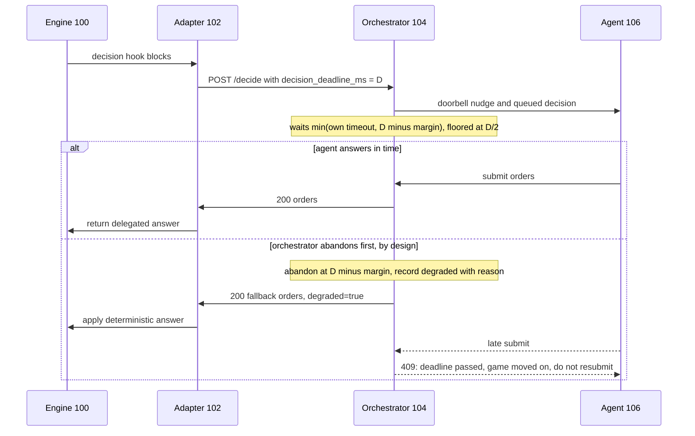
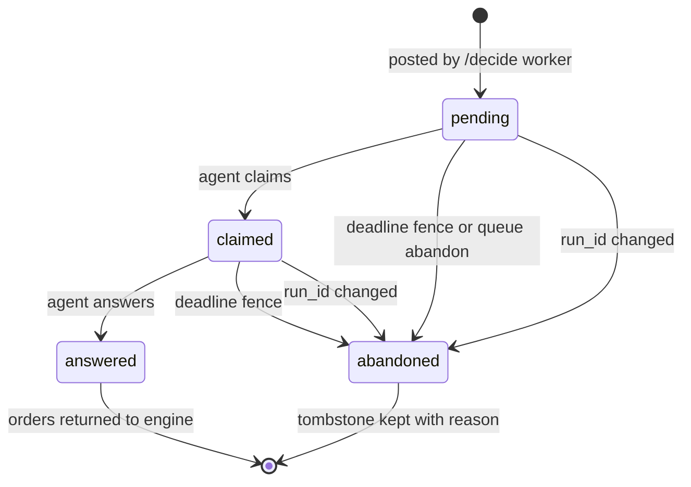
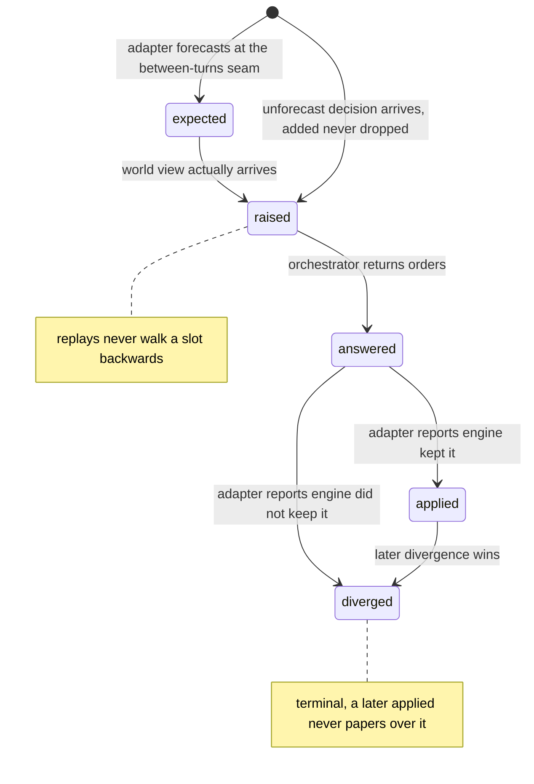

# PROVISIONAL PATENT APPLICATION

## Deadline-Fenced Delegation of Decision Surfaces from a Synchronous Engine to an Asynchronous External Decision-Maker with Fallback-Gated Tiering

**Inventor:** Stephen C. Brown *(name pending legal-name verification; sole inventor)*

**Filing type:** Provisional application for patent under 35 U.S.C. § 111(b)

**Docket reference:** neuralamplifier-decision-delegation-001

---

## FIELD OF THE INVENTION

The present invention relates to the control of real-time and turn-based simulation engines, and more particularly to adapter and orchestration machinery by which individual decision points of a synchronous, blocking, restartable engine are selectively delegated to a slow, expensive, fallible, asynchronous external decision-maker — for example a large language model ("LLM") or an interactive LLM agent — without stalling, corrupting, or silently degrading the engine. Specific aspects relate to (i) fallback-gated, per-surface enablement of a delegated decision tier over a frozen registry of decision surfaces; (ii) reconciliation of two independent clocks across a decision boundary by deadline fencing, together with process-generation fencing that detects engine restarts without liveness probing; (iii) standing directives constrained to a closed, measurable metric vocabulary, retrieved by graph walk and quantified as per-action trade-offs; (iv) provenance-governed rule knowledge with read-side anti-masquerade filtering and precedence-ordered token budgeting; (v) falsifiable grounding through citation and state guards feeding a bounded repair loop; (vi) a derived fairness ledger with drift detection; (vii) redundant information-flow gating ("fog as a control"); (viii) a dual-channel command architecture pairing a synchronous decision hook with an asynchronous, crash-safe command channel; (ix) non-collapsing outcome and turn accounting in which silence is never read as success; and (x) an agent-as-decision-maker attachment over a tool protocol with injection-safe notification.

---

## BACKGROUND

### The technical problem: synchronous engines and asynchronous deciders

A large class of software engines — game engines, simulators, industrial controllers, trading systems — are **synchronous and blocking at their decision points**: at some interior call site, the engine requires an answer *now*, as a return value on the calling thread, before any further state can advance. Such engines are frequently **single-threaded and not thread-safe** at those call sites, so the answer cannot be computed concurrently and merged later. They are also **restartable**: the engine process can crash, be killed, or be relaunched at any time, independently of any external service that was serving its decisions.

External machine-learned decision-makers — and most acutely large language models and LLM-driven interactive agents — have the opposite properties. They are **slow** (seconds to minutes per decision, and an interactive agent may legitimately deliberate for minutes), **expensive** (each consultation has monetary cost), **fallible** (they can return ill-formed answers, reference actions that were never offered, cite facts that were never supplied, or fail entirely), and **asynchronous** (they run in a different process, often on a different machine, connected by a network that can drop, and they hold no lock on the engine's thread).

Bridging these two regimes raises a family of technical problems that a naive "call the model from the engine" integration does not solve:

1. **Partial delegation.** An engine may expose dozens of distinct decision points ("decision surfaces"). Delegating all of them at once is neither affordable nor safe; delegating one at a time requires per-surface configuration whose failure modes (a typo silently enabling nothing; a disabled surface counted as a failure) corrupt the very measurements used to judge the rollout. Moreover, some surfaces have **no native fallback answer at all** — the engine's own logic never decides them — so enabling a fallible external decider there converts every external failure into a stalled or corrupted engine.

2. **Two clocks, no shared authority.** The engine-side hook waits only so long before applying its own answer and moving on; the external side has its own timeout. If the two deadlines are unreconciled, an answer can arrive *after* the engine has moved on, be accepted by the external service, and be recorded as a successful delegated decision for a state transition it never influenced — a measurement corruption invisible in every individual log.

3. **Restart detection without liveness.** When the engine process dies mid-decision, the external service holds pending work raised by a process that no longer exists. No countdown fires (the service is blocked waiting); client-disconnect is not reliably observable in common synchronous HTTP server frameworks; and an absolute age cap cannot distinguish a dead engine from a decider legitimately deliberating for a long time — which the architecture deliberately supports. Stale pending work indistinguishable from live work causes an expensive decider to spend real reasoning on decisions that can never land.

4. **Long-horizon intent.** A per-decision protocol gives the decider no memory: a well-reasoned long-horizon plan made at one decision point is invisible to the next. Free-text "memory" fields drift into unmeasurable ambition ("play aggressively") that can never be checked, silently becoming decoration.

5. **Knowledge trust.** Rule knowledge injected into the decider's prompt may come from canonical sources, from modified ("house-rule") variants, from observation, or from aspiration. If a modified rule surfaces as canonical, the decider reasons from a rulebook the engine is not running.

6. **Unfalsifiable grounding.** A decider that cites nothing and a decider that cites a fact nobody supplied both look like reasoning. Without machinery that checks citations against what was actually offered, and orders against the state they will be applied to, retrieval-augmented decision-making cannot be evaluated or trusted.

7. **Silence read as success.** Across every channel — orders issued, outcomes awaited, notifications rung — the absence of a report is systematically misread as confirmation. An order consumed by a crashing engine, an outcome never reported, a forecast decision that never arrives: each looks exactly like success unless the accounting refuses to collapse "unknown" into "applied".

### Admitted prior art

The **broad architecture of an external process reading game or simulation state and issuing validated commands is admitted prior art and is not claimed**. This includes, without limitation: the Arcade Learning Environment (ALE) and the OpenAI Gym / Gymnasium interface family, in which an external policy receives an observation and returns an action per step; the StarCraft II Learning Environment (SC2LE) and its raw and feature-layer APIs; the Dota 2 bot scripting API; CivRealm and other Freeciv-derived research environments exposing turn-based state to external agents; harnesses in which an LLM plays a video game by reading state and emitting button presses or commands (e.g., the well-publicized "LLM plays Pokémon" arrangements); and game-facing servers exposing state and actions over the Model Context Protocol ("MCP") or similar tool protocols. Also admitted: action masking and legal-action lists supplied by an environment; generic request/response RPC between a game process and an external service; W3C Trace Context as a correlation standard; SHACL validation of RDF data; SPARQL retrieval; and watchdog-timer fallback control generally.

The invention lies not in the existence of an external decider, but in the **adapter and orchestration machinery** — enumerated in the Summary below — by which individual decision surfaces of a synchronous, blocking, restartable engine are delegated to such a decider *safely, measurably, and honestly*. The mechanisms are described with respect to a working embodiment that delegates decisions of the game *Sid Meier's Alpha Centauri* ("SMAC") through a modified engine ("Thinker" fork) to an LLM or LLM agent, but, as detailed in the alternative embodiments, they apply to any real-time or turn-based system consulting a slow external model — robotics supervisors, industrial-control advisories, and trading systems among them.

---

## SUMMARY OF THE INVENTION

The invention is embodied in a decision-delegation system comprising an engine-side adapter and an external orchestrator service. The adapter intercepts decision points inside a synchronous engine, composes a fog-limited world view together with an engine-authoritative enumeration of legal actions (an "action space"), and transmits it to the orchestrator (`POST /decide` over HTTP/JSON in one embodiment). The orchestrator consults a configured decision-maker ("brain") — a scripted policy, a direct LLM call, or an attached interactive agent — and returns orders referencing actions **only by identifiers from the transmitted action space**, so the external decider can never invent an action. Within that system, the following aspects are disclosed.

**In one aspect (fallback-gated per-surface tiering)**, every decision point the engine can raise is assigned a stable identifier in a **frozen registry of decision surfaces** (77 in the working embodiment: 25 base/economy-scope, 32 unit-scope, 20 faction/turn-scope). A per-surface policy file states whether the delegated ("LLM") tier may decide each surface, with an explicit default for unlisted surfaces that is **false** in the working configuration; an identifier not in the frozen registry is **refused at load time** rather than silently ignored, because a toggle that appears set and does nothing is the worst outcome such a file can produce. A surface switched off is decided by the engine's own deterministic tier, and the orchestrator still emits a **complete decision record** for it at `tier="deterministic"` — explicitly *not* counted as degraded, so a run with surfaces deliberately off cannot be confused with a run in which the delegated tier was silently failing. The registry further marks the surfaces the native engine never decides at all (21 in the working embodiment), and the system enforces a **sequencing invariant**: the delegated tier is permitted on a surface only where a deterministic fallback answer already exists, so every failure of the slow, fallible decider degrades to a safe answer rather than to a stall.

**In another aspect (two-clock reconciliation by deadline fencing)**, the adapter stamps each transmitted decision with a deadline field (`decision_deadline_ms`) that is defined as a **statement of fact about the engine thread** — after that interval the adapter stops reading, applies the deterministic tier's answer, and moves on — and not as a request. The orchestrator waits on the *tighter* of that engine deadline and its own configured timeout, **minus a margin** (250 ms in one embodiment, floored at half the engine's allowance so the wait can never go negative), so that the orchestrator **deliberately and always loses the race**: it abandons first, records an honest degradation, and refuses a late answer (in one embodiment with HTTP 409 and a reason explaining that the game has applied its own fallback and moved on). The field's absence semantics are explicit and non-destructive: an **absent** deadline means the engine did not say, and the orchestrator must not invent a bound; a **zero or negative** value is read as "wait indefinitely" and the adapter deliberately omits the field rather than sending a literal zero, because zero on the wire is the value most likely to be misread as "abandon immediately".

**In another aspect (process-generation fencing)**, the adapter composes an opaque run identifier (`run_id`) at first use from three components each covering what the others cannot — the process identifier (separating overlapping runs), a monotonic tick count since machine boot (separating sequential runs across PID recycling), and wall-clock seconds (separating runs across a reboot) — **deliberately without any random number generator**, because in the working embodiment the engine's `rand()` shares the game's seed and perturbing simulation state to obtain a correlation identifier is an unacceptable trade. The orchestrator asks exactly one question of this identifier — *is it the same string as last time* — and on a change **retires every live pending decision**: each blocked engine-side request is released with a degraded record naming the restart, stale decisions leave every agent-facing listing in the same instant, and late answers are refused with a message stating that the raising process is gone. Absence of the field reads as *cannot tell*, never as *a new run*; the first identifier ever seen is adopted without retiring anything. The design is chosen over an absolute age cap (which cannot distinguish a dead engine from a decider legitimately thinking for minutes) and over client-disconnect detection (not reliably observable inside synchronous HTTP handlers): the restart announces itself, needing no timer and no liveness probe.

**In another aspect (measurable standing directives)**, the external decider may issue **directives** — standing intent that outlives the decision that issued it — but a directive may only reference a metric name drawn from a **closed vocabulary** of quantities that adapters actually report; anything else is **rejected at issue time, while the model that wrote it is still in the loop and can rewrite it**, rather than accepted and silently unevaluable forever. A vocabulary metric absent from a particular world view evaluates to an explicit **"unmeasurable"** status, distinct from satisfied — a missing measurement must never read as a satisfied one. Actions carry declared immediate effects as metric deltas; the orchestrator computes, for each action touching a directive's metric, a **trade-off row**: the delta, the projected value, whether the action **would newly violate** the directive, and — where a companion rate metric is declared — a **setback expressed in turns of flow** (e.g., "spending 81 credits is 21 turns of saving at current income"), converting a one-off stock cost into a quantity commensurable with the benefit. Directives are **retrieved, not broadcast**: a bounded graph walk starting from the resources the pending decision would actually move, expanding through directive-declared entity links for a limited number of hops, with the traversal path attached as explanation and everything not shown recorded. In a measured example, a decision surface that split 6/4 across ten identical trials with no plan became **unanimous** under a single priority-7 saving directive, with the directive followed in every trial.

**In another aspect (provenance-governed rules with read-side anti-masquerade filtering)**, canonical rule knowledge is extracted from the engine's rule file by a **deterministic parser** (no model in the extraction path) and emitted as an RDF graph (approximately 3,579 facts in the working embodiment) in which **every fact carries three provenance predicates by construction** — the engine it applies to, a rule tier from a closed set {canonical, house-rule, engine-observed, aspirational}, and a source pointer — the emitter refusing to write a node without them and a SHACL write-time gate refusing facts that lack them. The **read side enforces the other half**: every retrieval query filters on the engine predicate, with no code path that omits it, so a modification's house-rule can never surface as canonical in a different engine's game. Retrieval is bounded to the pending decision's action space by a single batched query; a token budget bounds prompt size rather than fact count, **sheds the least-trusted class first** (tactics before rules), announces in the prompt what was omitted, and records the shed set on the decision record.

**In another aspect (falsifiable grounding)**, retrieved facts are injected **identifier-first**, each line beginning with a citable graph identifier, so the decider's returned citations can be audited. A **citation guard** distinguishes three failures with different causes: citations never offered (fabrication), citations offered but unresolvable in the graph (a knowledge-integrity fault, not the model's), and facts offered with none cited — always as advisories, never denials. A **state guard** denies orders whose declared spending exceeds a declared pool metric, applying this test **only** to metrics the vocabulary explicitly flags as spendable pools — a flag introduced after a deployed guard inferred "budget" from "lower is better" and thereby denied every legal option of an entire surface. Denials feed a **bounded repair loop**: the decision is re-asked at most a clamped number of times (0–2, default 1) with accumulated advisories attached to the *original* world view, exactly one decision record is emitted regardless of attempts, and violations accumulate across attempts so a corrected mistake still counts as a mistake.

**In another aspect (derived fairness ledger)**, rule asymmetries in force between the delegated decider's seat and other seats are **derived from (seat type, difficulty, engine configuration) by evaluable rules with cited source locations**, rather than copied from a static table — because entries flip which side they favour as difficulty moves and some are inert under shipped configuration. The ledger separates **structural** asymmetries (present at every difficulty, which nobody selected) from **difficulty-selected** ones; it is declared into the decider's prompt so the model reasons about its own advantages, and stamped onto every decision record so results remain interpretable. A **drift function** compares any adapter-stamped ledger against the derived truth, reporting missing, unexpected, and mislabelled entries — catching an adapter that quietly stops stamping, which otherwise looks exactly like a clean run.

**In another aspect (fog as a control)**, the orchestrator **re-applies** an information-visibility gate that the adapter is already supposed to have applied — in the working embodiment, dropping diplomacy events naming parties the delegated faction has never contacted — counting redactions onto the decision record so a leaking adapter shows up as a number rather than as a suspiciously good game. When the adapter supplies no contact list at all, the gate removes nothing and records `enforced=false`: absence of evidence is recorded as such, never as a fog-clean run.

**In another aspect (two doors)**, the system pairs the synchronous decision hook ("door 1": the engine asks, and an answer must be returned now) with an **agent-initiated command channel** ("door 2"): a command file polled at 4 Hz from the engine's message-pump context, **consumed before acting** so a command that crashes the engine cannot replay on relaunch, answered through a single result slot the issuing side clears before each write, wrapping engine primitives in semantic verbs, batching up to 32 orders into one envelope whose top-level success is true only when every order succeeded, and gating destination tiles through the engine's own visibility test. Serialization between the doors is obtained from a property the engine already has — the decision wait pumps messages without dispatching them, so commands cannot run while a decision is outstanding. An order whose result is never observed is reported **unknown, never ok**, with the consumed and never-read cases distinguished.

**In another aspect (non-collapsing outcome and turn accounting)**, the system distinguishes three propositions that collapse in conventional designs: what the decider **chose**, what the orchestrator **applied** (after validation and guards), and what the engine **did** (the adapter reads the state back after applying and emits divergence events when the engine did not keep the decision). Correlation across all three is by W3C trace context stamped by the adapter on every decision for every brain, so outcome accounting requires no decider-specific identifier. Silence is "unknown", never "applied"; a query for an unreported outcome returns HTTP 200 with status `unknown` rather than 404, because a 404 invites a caller to treat "no answer yet" as "nothing went wrong". A per-turn view records the adapter's forecast of coming decisions as a **forecast, not a promise**: forecast and arrived are different words, never collapsed into one count; unforecast decisions are added rather than dropped; per-decision status never walks backwards; and divergence is terminal.

**In another aspect (agent-as-brain with injection-safe nudging)**, an interactive agent is attached as the decision-maker through a small tool surface (in one embodiment, MCP tools to find a waiting decision, read it, and answer it, plus directive, direct-order, and outcome tools) backed by an in-memory decision queue in which each pending decision has a **claimed** state so two attached agents cannot both answer it. The agent receives the **fully grounded** world view — retrieval, directives, and trade-offs are injected before any brain is consulted — and its answer passes through the identical validation and guard path as a model's. An optional terminal notification ("doorbell") deliberately carries **no data from the engine**: every name in a world view is player-supplied (a base named `"; rm -rf ~` is legal), so the nudge is a fixed sentence plus a service-generated identifier matched against a character whitelist, and the channel is best-effort by construction — a polling agent needs none of it.

---

## BRIEF DESCRIPTION OF THE DRAWINGS

The drawings are presented textually as diagrams within the Detailed Description.

**FIG. 1** is a system block diagram showing a synchronous engine (100), an engine-side adapter (102), an orchestrator service (104), interchangeable decision-makers including an attached interactive agent (106), a provenance-governed knowledge store (118), and the two command doors between adapter and engine.

**FIG. 2** is a flow diagram of one pass through the orchestrator's decision loop (200-series numerals), from fog gating through grounding, directive injection, the per-surface policy gate, validation, guards, bounded repair, fallback, and record emission.

**FIG. 3** is a sequence diagram of two-clock reconciliation: the engine deadline, the orchestrator's margin-shaved wait, honest degradation, and the refusal of a late answer.

**FIG. 4** is a state diagram of a pending decision's lifecycle in the decision queue, including the claimed state and retirement by process-generation fencing.

**FIG. 5** is a diagram of directive retrieval by graph walk from the resources a decision would move, and of trade-off computation against declared action effects.

**FIG. 6** is a diagram of the dual-channel ("two doors") architecture, including the consume-before-act command file, the single result slot, and serialization from the engine's no-dispatch message pump.

**FIG. 7** is a state diagram of non-collapsing outcome and turn accounting, showing the forecast/raised/answered/applied/diverged statuses and the monotonicity rules between them.

**FIG. 8** is a flow diagram of the provenance pipeline from deterministic rule-file parsing through tagged emission, write-time validation, engine-filtered retrieval, and precedence-ordered token budgeting.

---

## DETAILED DESCRIPTION

### 1. System overview (FIG. 1)

```mermaid
flowchart LR
    subgraph ENG["Engine process"]
        E[Engine 100&#44; synchronous&#44; not thread-safe]
        A[Adapter 102]
        CF[Command file 138a]
        RF[Result slot 138b]
        E -- decision hook door 1 --> A
        A -- 4 Hz poll door 2 --> CF
        A -- writes --> RF
    end
    subgraph ORCH["Orchestrator service 104"]
        D[POST /decide handler]
        L[Decision loop 200]
        Q[Decision queue 112]
        G[Guard chain 120]
        DS[Directive store 126]
        OS[Outcome store 134]
        TS[Turn store 136]
        OC[Order channel 139]
        REC[Decision log 140]
    end
    K[(Knowledge graph 118 provenance-tagged)]
    AG[Agent 106 over MCP 116]
    LLM[LLM brain 105]
    A -- world view + action space --> D
    D --> L
    L --> G
    L --> DS
    L --> REC
    L -- brain seam --> Q
    L -- brain seam --> LLM
    Q <--> AG
    L -- retrieval --> K
    A -- POST /outcome --> OS
    A -- POST /turn --> TS
    OC -- writes --> CF
    RF -- read by --> OC
    AG -- issue_order --> OC
```

A synchronous engine (100) — in the working embodiment the SMAC binary as modified by the Thinker fork — reaches interior decision points at which a value must be returned on the calling thread before the simulation can advance. An adapter (102), compiled into the engine process, intercepts a chosen subset of these points. At each intercepted point it composes a **world view**: a versioned JSON document carrying the visible game state (fog-limited map, units, bases, economy), engine-neutral named measurements (`metrics`), a declared fairness block, telemetry fields (`surface_id`, `trace.traceparent`, `decision_deadline_ms`, `run_id`), and — critically — an **action space**: the complete, engine-authoritative enumeration of legal actions for this decision, each with an identifier. The adapter POSTs this to the orchestrator's `/decide` endpoint and blocks, up to its own deadline, for orders in reply. Orders reference actions **only** by action-space identifiers; the adapter applies each returned order through the engine's own validation, so the contract is never the last line of defense against illegality.

The orchestrator (104) is a service (FastAPI over HTTP in the working embodiment) holding the decision loop (§2, FIG. 2) and its supporting stores. The decision-maker is reached through a one-line seam (`brain.decide(world_view)`), behind which three implementations are interchangeable: a scripted deterministic policy (the default, so that automated test runs can never make a paid model call by accident), a direct LLM call, and an **agent brain** (106) that parks the decision on a queue (112) and blocks until an attached interactive agent answers over MCP tools (§11). Every invariant the loop protects — fog gating, grounding, directive trade-offs, action-space validation, guards, the decision record — lives *around* that seam, which is what makes the agent attachment one class rather than a second pipeline.

Because the identifiers below recur throughout: (100) engine, (102) adapter, (104) orchestrator, (105) LLM brain, (106) attached agent, (108) frozen surface registry, (110) surface policy, (112) decision queue, (114) doorbell, (116) MCP tool surface, (118) knowledge graph, (120) guard chain, (122) citation guard, (124) state guard, (126) directive store, (128) metric vocabulary, (130) fairness ledger, (132) fog gate, (134) outcome store, (136) turn store, (138a/138b) command/result files, (139) order channel, (140) decision log, (142) world-view store, (144) token-budget module.

### 2. The decision loop (FIG. 2)

```mermaid
flowchart TD
    S([world view arrives at /decide]) --> F[202 fog gate 132 redacts uncontacted-party deltas&#44; counts removals]
    F --> R[204 retrieval from 118&#44; engine-filtered&#44; budgeted by 144]
    R --> I[206 inject facts id-first into world view]
    I --> DIR[208 inject standing directives measured&#44; plus trade-off rows]
    DIR --> ST[210 store exact grounded bytes in 142]
    ST --> P{212 policy 110 allows surface?}
    P -- no --> DET[214 emit full record tier=deterministic&#44; empty orders&#44; NOT degraded]
    P -- yes --> B[216 brain.decide via seam]
    B --> V[218 validate: drop out-of-space and duplicate action ids&#44; count violations]
    V --> GU[220 guard chain 120 rules on surviving orders]
    GU --> OK{222 any choice survived?}
    OK -- yes --> REC[228 emit one decision record&#44; return orders]
    OK -- "no&#44; repairs remain" --> REP[224 re-ask with advisories accumulated onto original view&#44; max 0-2 attempts]
    REP --> B
    OK -- "no&#44; exhausted" --> FB[226 safe fallback&#44; degraded=true with reason]
    FB --> REC
    DET --> E([done])
    REC --> E
```

Every path through the loop emits **exactly one** decision record (140) — including the deterministic path (214) and the fallback path (226) — because a fallback that is not recorded is precisely the failure the observability design exists to catch: a run of silent fallbacks is otherwise indistinguishable from a run of real decisions. The record carries the tier, a hash of the exact world-view bytes the brain saw (the store (142) at step 210 is written *after* gating and grounding so that replay replays the true input), the chosen actions, degradation status and reason, latency, adherence violations, the knowledge and plan measurement blocks, the fairness profile, and the fog redaction count.

The ordering of steps is load-bearing. The fog gate (202) runs before anything reads the deltas. Grounding (204–206) and directives (208) are injected **before** the brain seam so that an attached agent receives the identical fully-grounded view a model would. The policy gate (212) runs after the world view is complete — so a switched-off surface still writes a full record — and before the brain, so a disabled surface costs no model call.

### 3. Fallback-gated per-surface tier enablement (108, 110)

#### 3.1 The frozen registry (108)

Every decision hook the adapter can intercept emits a stable surface identifier of the form `<domain>.<decision>` (e.g., `base.production`, `faction.tech`, `unit.move`). The registry is **frozen**: coverage reports and decision records key on these identifiers, so renaming one invalidates every previously recorded run; adding is permitted, changing or removing is a breaking change. The working embodiment's registry holds 77 surfaces — 25 base/economy scope, 32 unit scope, 20 faction/turn scope — held as frozen sets in one module, with a lookup from surface to contract scope.

Two further subsets are marked in the registry itself, because they drive policy:

- **`NO_AI_PATH`** (21 surfaces): surfaces the native engine AI never decides — reachable in the unmodified game only through a human dialog. These have **no deterministic fallback answer**, and the system's sequencing invariant (below) therefore forbids enabling the delegated tier on them until a deterministic tier is first built.
- **`OBSERVED`** and **`APPLIED`**: surfaces the adapter reports (a record is written but the engine's own choice still executes) versus surfaces where the delegated choice actually executes, validated against the engine's own availability tests. A surface belongs to `APPLIED` only when the adapter exports a decide entry point **and** the engine call site assigns its return; observation alone must not be counted, or the coverage number claims influence the decider does not have. In the working embodiment five surfaces are observed and four applied; the coverage function computes, rather than asserts, the partition of the remainder into `needs_tier_first` (no fallback exists), `volume_bound`, and `ready`.

#### 3.2 The per-surface policy (110)

A configuration file section (`[surfaces]` in `na.toml`) holds one boolean per surface identifier, plus `surface_default` for everything unlisted — **false** in the working configuration, because 73 of 77 surfaces have never been instrumented and defaulting them on would claim the delegated tier decides things no adapter even reports. Three semantics are enforced:

1. **An unknown identifier is refused at load, not ignored.** A typo'd surface would otherwise be a toggle that appears set and does nothing, surfacing only as "why is the brain still deciding that". Load-time refusal converts the silent misconfiguration into a failed start.
2. **Absent is not empty.** No policy file at all means nobody has expressed an opinion, and the orchestrator decides everything it is handed (its behavior before the mechanism existed). A file that *exists* and omits a surface has an opinion — the default. Both directions of explicit toggles are stored, so an identifier set false under a true default cannot be silently re-enabled by storing only the enabled set.
3. **Off is not degraded.** A disabled surface takes path (214) of FIG. 2: the orchestrator returns empty orders (the adapter then applies its own answer, exactly as before delegation existed) and emits a **full decision record at `tier="deterministic"`**, explicitly not degraded. Degradation is measured over delegated-tier decisions only, protecting the single number that catches a run in which the brain was silently absent — the one metric that must not be able to lie in that direction — from pollution by deliberate configuration.

#### 3.3 The sequencing invariant

The delegated tier is enabled on a surface **only after a deterministic tier exists for that surface**. The invariant follows from the deadline fencing of §4: every timeout, network failure, guard denial, or model failure resolves by applying the deterministic answer; on a surface with no deterministic answer there is nothing to degrade *to*, and a fallible decider's failure becomes a stalled or corrupted engine. The registry's `needs_tier_first` partition makes the invariant a computed property of the rollout plan rather than a convention. The rollout path for any new surface is thus: instrument (observe), watch, then enable (apply) — each step reversible in configuration without a deploy.

#### 3.4 Alternative embodiments

The registry generalizes to any enumerable set of delegation points in a host system: robot-behavior selection points, setpoint overrides in an industrial controller, order-routing choices in a trading system. The essential elements are (a) frozen, stable surface identifiers keyed by every downstream record; (b) load-time refusal of unknown identifiers; (c) a three-way distinction among *delegated*, *deliberately deterministic*, and *degraded*, with the deliberate case emitting complete records outside the degradation metric; and (d) gating delegation on the prior existence of a safe local fallback for the same surface.

### 4. Two-clock reconciliation by deadline fencing (FIG. 3)

#### 4.1 The problem, measured

Before the mechanism existed, the working embodiment's adapter abandoned a decision after 2,500 ms while the orchestrator's agent brain waited indefinitely. A late answer then completed the orchestrator-side decision loop for a turn the game had already resolved, and was recorded as a successful, non-degraded delegated decision. Measured over one run: 66 adapter-side rows, **zero** of them decided by the delegated tier — against orchestrator records claiming applied delegated decisions for the same turns. Both logs were internally consistent; the lie lived only in their join.

#### 4.2 Operation

The adapter stamps `decision_deadline_ms` as a statement of fact: after D milliseconds it stops reading the socket, applies the deterministic tier's answer, and moves on; an answer arriving later reaches nobody. The orchestrator computes its wait as the tighter of its own configured timeout and `D − margin`, where the margin (250 ms in one embodiment) covers the reply's trip back to the adapter — the engine's clock starts at its send and stops at its receive, not at the orchestrator's local wakeup. The shave is **floored at D/2**: a fixed subtraction goes negative on a very tight deadline, and a negative wait abandons instantly, converting a merely-difficult deadline into a decision the decider was never offered. The two deadlines are thereby never raced — if both sides abandoned at the same instant, the outcome would depend on scheduling and network latency, and the losing case is exactly the measured failure above. Losing the race **deliberately and always** is the only arrangement that can be reasoned about.

On abandonment the pending decision is marked abandoned with a reason that is written for its actual reader — the decider: *"the engine's 2500ms deadline passed with no answer; the game has applied its own fallback and moved on. Do not resubmit this decision — re-read the board and answer the next one."* A late answer is refused (HTTP 409 in the working embodiment) carrying that text, because a bare "abandoned" reads to a model as *try again*, which is exactly the wrong move. A backstop remains at the submit-acknowledgement path: if an answer arrived within the shave but the post-answer work (grounding of the response, guards, possibly a repair) carried the total past the engine's deadline, the acknowledgement says "NOT applied" with the same explanation, computed by comparing the pending decision's age against the deadline.

#### 4.3 Absence semantics: absent ≠ 0 ≠ default

Three states of the deadline field are deliberately distinct:

- **Absent**: the engine did not say. The orchestrator cannot bound its wait to anything the engine will still be listening for, and must not invent a deadline — doing so would abandon decisions the engine was still blocked on. Absent is the state of every adapter predating the field.
- **Zero or negative**: read identically to "wait indefinitely", matching the adapter-side socket-arming convention and the orchestrator's own timeout convention (the value a person types meaning "no timeout" is 0 far more often than "time out immediately"). The adapter nonetheless **omits** the field rather than sending 0, because a literal zero on the wire is the value most likely to be misread as *abandon immediately* — turning a deliberate no-limit run into an instant fallback on every decision, with nothing in either log resembling a misconfiguration.
- **Positive**: the fence of §4.2.

#### 4.4 Alternative embodiments

The mechanism applies wherever a blocking consumer with its own watchdog consults a slow external service: the consumer states its watchdog as a fact on each request; the service waits on the tighter of the stated deadline and its own budget minus a margin covering the return path, floored at a fraction of the allowance; the service abandons first, records honest degradation, and refuses late completions with an actionable explanation. Transports other than HTTP (message queues, shared memory, gRPC) and margins derived adaptively from measured round-trip times are within the scope of this aspect.

### 5. Process-generation fencing (FIG. 4)

#### 5.1 The problem, measured

The deadline fence covers an engine that is *alive and has stopped waiting*. It cannot cover an engine that no longer *exists*: nothing on the orchestrator side counts down while a decision loop is blocked, so a dead process's deadline is never reached by anything. Measured in the working embodiment: a game was killed mid-decision and relaunched; the still-running orchestrator offered four pending decisions, ages 600–1,275 seconds, every one raised by a process dead for twenty minutes, and claiming and answering one returned the ordinary success response. An attached agent had no way to tell them from live work, and the queue could not answer "is the game waiting on me?" at all.

#### 5.2 Generating the identifier

The adapter composes `run_id` at first use from three components, each covering what the others cannot: the **process id** (two overlapping live processes never share one), the **tick count since boot** (monotonic, so a later process reads a strictly larger value, separating sequential runs where a PID may be recycled), and **wall-clock seconds** (separating runs across a reboot, which resets the tick count). There is deliberately **no random number generator** in the composition — and emphatically not the engine's: in the working embodiment `rand()` inside the game DLL shares the game's seed, and perturbing map generation to obtain a correlation identifier is a bad trade. The orchestrator never parses or orders the identifier; it asks only whether it equals the last one seen.

#### 5.3 Operation

On each posted decision the queue applies three-case logic, and the two quiet cases are the ones that had to be right:

1. **No `run_id` on this world view**: do nothing, and do not touch the stored value. Absence means *cannot tell*, never *a new run* — every un-upgraded adapter is absent here, and reading absence as restart would destroy the pendings of an adapter behaving perfectly. Cannot-tell must not be destructive (the same rule the deadline field follows).
2. **First `run_id` ever seen**: adopt it, drop nothing. A first sighting is not evidence of a restart — the held decisions may belong to that very process.
3. **A different `run_id`**: the process blocked on every live decision has exited. Retire them all — including decisions that themselves carried no `run_id`, by inference from the invariant that **one orchestrator serves one game**, so a run that has ended takes everything older with it.

Retirement is atomic with respect to the queue's three reading surfaces: each retired decision stops being listed as waiting, stops being claimable, and becomes unanswerable in the same instant — the measured incident was precisely those three surfaces disagreeing. The supersede check runs **before** the queue's depth check, so a dead run's leftovers cannot push the live run over the depth bound and degrade its first turn; the blocked engine-side workers are released **outside the lock** and unconditionally, since whether the current post succeeds has no bearing on whether the old run ended. Each retired decision's blocked worker returns a degraded record naming the restart, and any late answer receives a refusal whose text names **both** runs — the work is unrecoverable, nothing can apply an answer to it, and the agent should collect a decision from the current run instead. An agent that answered a decision from run A and is now offered run B's needs to know its board state is stale, not merely that one call failed.

#### 5.4 Rejected alternatives and the stated limit

Two weaker designs were considered and rejected. An **absolute age cap** cannot distinguish a dead game from a decider legitimately deliberating for minutes, which the architecture deliberately supports. **Client-disconnect detection** is not reliably observable from inside the synchronous HTTP handlers used (a blocked synchronous worker does not learn its peer closed the socket). Process identity needs neither a timer nor a probe: the restart announces itself. The limit that follows is stated rather than discovered: a game killed and **never restarted** leaves its decisions in the queue, because the evidence is the next run arriving and there is no next run. What the mechanism guarantees is that a dead run's work can never be mistaken for the current game's — the failure that cost real reasoning time — while a queue nothing posts to is a state an operator can already see.

#### 5.5 Alternative embodiments

Any restartable producer consulting a long-lived decision service may stamp a generation identifier composed of process identity, a boot-monotonic counter, and coarse wall time (or any subset achieving the same pairwise separations); the service treats only *change* as evidence, retires all pending work of prior generations atomically across its listing, claiming, and answering surfaces, and phrases refusals so that an automated consumer is told the work is unrecoverable rather than retryable. Embodiments include robot controllers that reboot mid-mission and market sessions that roll daily.

### 6. Standing directives: long-horizon intent that must be measurable (FIG. 5)

#### 6.1 The problem

A per-decision protocol gives the decider no durable intent: a long-horizon decision that reasons well about a research path produces nothing the next production decision can see. The naive fix — a free-text memory field — accumulates untestable ambition. The invention's directive mechanism is built around one discipline: **a directive is only worth having if it can be checked**, and everything in the mechanism enforces checkability at the moment the plan is made, not after it has silently failed to steer anything.

#### 6.2 The closed metric vocabulary (128)

The vocabulary module holds **no values** — values arrive from the adapter in the world view's `metrics` block, an engine-neutral `{name: number}` mapping, because the orchestrator must not learn where a particular engine files its economy. What it holds is names and metadata: for each metric, a scope (faction-level or per-base), unit, improvement direction (`higher`, `lower`, or none where neither direction is inherently good), a description, and a **`pool` flag** stating whether the reported value is a spendable stock with an engine-enforced floor at zero (§8.3 explains why this flag must live here). The working embodiment's vocabulary is deliberately small — eleven metrics, e.g. `energy_reserves` (the only pool), `energy_income`, `mineral_surplus`, `minerals_remaining` — and every name is one an adapter actually emits, a promise enforced by tests from both ends (vocabulary-versus-adapter as a set; every faction-scope name required in every pinned adapter record). An aspirational name is worse than a missing one: a directive written against it is accepted at issue time and evaluates unmeasurable forever, which in a record reads as compliance rather than as a gap.

A directive comprises an identifier, intent text, a metric name, a comparator (`at_least`, `at_most`, `increase`, `decrease`, `hold`), an optional target, a priority (1–10 on a scale with fixed meaning across decisions that never see each other), optional entity links into the knowledge graph, and an optional horizon turn. **Validation runs where a directive is issued, never where it is applied**: a directive naming a metric outside the vocabulary, or an absolute comparator without a target, is refused while the model that wrote it is still in the loop and can rewrite it — the alternative, discovering on every later turn that a plan was never expressible, is far more expensive than one refusal now. Relative comparators are measured against a **baseline stamped by the orchestrator from the issuing world view** — deliberately not the model's job, since it was shown the number and asking it to repeat one it has read is a chance to paraphrase it wrong; a relative directive whose metric the issuing view did not report is rejected outright, because nothing later can supply a baseline for a turn that has passed. Rejections are returned as messages rather than raised as errors, so a bad plan never costs the decision it arrived with. Re-issuing a directive id replaces the prior copy; expired directives are dropped as they are noticed; a **degraded decision may not issue directives at all** — the fallback did not reason about anything, and a plan attributed to it would be a plan nobody made, steering every decision afterwards.

#### 6.3 Measurement, and the unmeasurable status

At each decision, every shown directive is evaluated against the current world view's metrics into a status: the current value, whether it is satisfied, and a one-line detail. A vocabulary metric **absent from this world view** evaluates to `satisfied = null` with a detail stating the directive cannot be checked here — explicitly distinct from satisfied and from violated. Treating an absent measurement as satisfied is the failure that would let the mechanism drift into decoration, and the working embodiment met exactly this shape when an adapter emitted correct numbers under a wrong key: every directive evaluated unmeasurable while still appearing in force, so a plan steering nothing read as a plan being served. A `hold` comparator applies a tolerance band (±10% of baseline in one embodiment): a hold directive on a quantity that moves every turn would otherwise be violated by noise, and a directive that is always violated gets ignored — by a model as surely as by a person.

#### 6.4 Trade-off computation

Actions in the action space may declare `effects` — immediate, known metric deltas. The contract is strict that *immediate* means immediate and that **an absent effect beats a plausible one**: in the working embodiment, the hurry action declares both of its legs (spends `energy_reserves` now, takes `minerals_remaining` to zero now) while the production-choice action declares nothing, because choosing a build item spends nothing on the turn it is given — and a single wrong declared effect once took an entire surface off the delegated tier (§8.3). For each (action, directive) pair where the action's declared effect touches the directive's metric and a current value is reported, the orchestrator emits a **trade-off row**: the delta, the projected value, `would_violate` — true only when the directive is satisfied now and not after, i.e., the action *newly* breaks it — and `setback_turns` where a **rate map** relates the stock metric to a flow metric (`energy_reserves` → `energy_income`; `minerals_remaining` → `mineral_surplus`): `|delta| / |rate|`, converting "81 credits" into "21 turns of saving", a number a decision can weigh directly against finishing production seven turns early. No current value means no projection, and no known rate means no setback figure — a setback with an invented denominator is worse than none, because it looks like the one piece of hard arithmetic in the block. Only genuine conflicts are emitted, so a non-empty trade-off block is itself a signal.

#### 6.5 Retrieval by graph walk, not broadcast

```mermaid
flowchart TD
    A[Pending decision] --> M[hop 0a: metrics its actions would move via declared effects]
    A --> EN[hop 0b: entities the decision concerns via grounding ids]
    M --> D1[directive about that resource e.g. save energy_reserves]
    EN --> D2[directive naming that entity]
    D1 --> H1[hop 1: entities those directives name e.g. a secret project]
    H1 --> D3[directive about the project]
    D3 --> H2[hop 2: higher-order plan on the same entity]
    ALW[priority &#8805; 9: shown regardless] --> SEL
    D1 --> SEL[ranked selection&#44; limit 8&#44; first path wins&#44; path attached as via]
    D2 --> SEL
    D3 --> SEL
    H2 --> SEL
    SEL --> DROP[everything unreached or past the limit recorded as dropped]
```

A long game accumulates directives; injecting all of them into every world view would cost more than the entire grounding budget and bury the two that matter. A directive is therefore **retrieved like a fact rather than broadcast like a setting**. The walk starts from what the decision actually does: hop 0 pulls every live directive whose metric one of the offered actions would move (via declared effects) and every directive naming an entity on offer; each directive reached then contributes its own entity links as the next frontier, for a bounded number of hops (two in the working embodiment — enough for the motivating chain: an action spends energy credits → the saving directive → the project being saved for → the plan that project serves). Expansion after hop 0 is through **entities only**: following metrics transitively would pull every directive sharing a common measure and turn a targeted walk into a broadcast with extra steps. The first path to reach a directive wins and travels with it onto the injected status (`via`, `hop`) — the path *is* the reasoning the decision needs, so it is shown rather than kept as bookkeeping. Priority breaks ties rather than driving selection, with two exceptions: survival-priority directives (≥ 9) are shown regardless, because a plan nobody is told about cannot be followed, and a directive whose metric this view reports is shown at the lowest rank because it can at least be checked here. Everything unreached, or past the selection limit (8 in one embodiment), is recorded as `not_shown` on the decision record — a silent cap is the failure that makes a plan look served when it was never read.

#### 6.6 Measured effect

On a recorded hurry decision (81 credits to save seven turns, 82 in reserve), a small LLM run ten times over identical prompts with no plan split 6/4 across the two answers (stability 0.60). Adding **one priority-7 saving directive** (`energy_reserves at_least 300`) moved the same ten-trial measurement to a **unanimous** "do not hurry", with the directive reported followed in 9 of 10 trials (attention 0.90); a two-directive configuration on the same observation measured 0.80. The working embodiment's own documentation notes the honest caveat that the exact 1.00 should not be quoted as though the mechanism makes a contested surface deterministic — what replicates is the direction and the attention. The surface was never short of rules; it was short of the opportunity cost of spending 81 of 82 credits, which is exactly what the trade-off row supplies.

#### 6.7 Attention accounting

Orders may name directives `followed` (standing intent that changed this choice) and `overrode` (intent knowingly worked against — recorded, never prevented, because a plan that can never be broken is a plan that loses games). Both lists are filtered against what was actually shown, exactly as citations are filtered against offered facts, so an invented id cannot inflate attention. Directive-linked entities shown through the plan block are unioned into the offered-citation set (§8.2) but excluded from retrieval-utilisation denominators — they were not retrieved and nothing paid for them.

#### 6.8 Alternative embodiments

The directive mechanism generalizes to any supervisory system in which a slow external planner sets standing constraints over a fast decision stream: fleet-management directives over robot task allocation ("keep charge above 30%"), process-control envelopes ("hold reactor temperature within 5% of setpoint"), risk directives over order routing ("keep sector exposure at most X"). The essential elements are the closed vocabulary of adapter-reported measurements as the issue-time gate; the explicit unmeasurable status; orchestrator-side baseline stamping; per-action trade-off rows with newly-violates semantics and rate-converted setbacks; and retrieval of standing intent by bounded graph walk from the resources a decision would move, with the traversal path exposed and the unshown remainder recorded.

### 7. Provenance-governed rules with read-side anti-masquerade filtering (FIG. 8)

```mermaid
flowchart LR
    RB[Engine rule file alphax.txt] --> P[deterministic parser&#44; no model]
    P --> T[RDF emitter: ~3579 facts&#44; every node carries appliesToEngine + ruleTier + sourcedFrom]
    T --> W{SHACL write gate}
    W -- lacks provenance --> REJ[refused at write]
    W -- tagged --> G[(graph store 118)]
    G --> Q[one batched query bounded to subjects + action space&#44; engine filter in every query]
    Q --> B[token budget 144: rules kept before tactics&#44; shed noted in prompt and on record]
    B --> INJ[id-first injection into world view]
```

#### 7.1 Deterministic extraction

Canonical rule knowledge is parsed from the engine's rule file by a plain parser — **no model in the extraction path**: the file is a fixed-arity comma-separated format a parser reads exactly, reproducibly, for free, whereas a model would return a probabilistic answer to a deterministic question whose worst failure (a hallucinated prerequisite indistinguishable from a real one) lands in precisely the plane whose point is trustworthiness. The parser handles documented format traps (line-initial-only comments except in two numeric sections; a `Disable` sentinel meaning "excluded" in one column family and "never" in another) and inspects the file's header for mod markers, because the working embodiment's mod ships its own rule file whose ingestion as canonical would be exactly the masquerade the tier system exists to prevent.

#### 7.2 Provenance by construction, enforced at write and read

Every emitted fact carries three predicates: `appliesToEngine` (closed set: the base game plus known engines), `ruleTier` (closed set: `canonical`, `house-rule`, `engine-observed`, `aspirational`), and `sourcedFrom` (a pointer to the source record — refused if empty, because it is the audit trail). The emitter refuses to write a node without them (a constructor-level check, so a bad tag fails before the expensive part), and a SHACL shape at the store refuses them again at write time. The **read side enforces the half that actually protects a decision**: every retrieval query filters on the engine predicate — facts tagged for the universal base game are legitimate in any engine; anything else must match the engine in play — and there is **no code path that omits the filter**. Without it the write-side tag is decoration and a mod's house-rule surfaces unchanged as canonical in a different engine's game. Retrieved facts carry their tier into the prompt when it is *not* canonical (tagging every canonical fact is noise, and noise is what stops the tag that matters being read) and always carry their compacted source pointer.

#### 7.3 Bounded retrieval and precedence-ordered budgeting

Retrieval is bounded **by construction** to the pending decision: one batched query enumerates only the decision's declared subjects plus its action-space labels (subjects first, so if anything must be dropped the entity the decision is *about* is the last to go), so the prompt grows with the choices on offer, not with the rulebook. A generous cap bounds the query's disjunction shape — a guard on query size, deliberately distinct from any fact limit, which applies to what the store returned rather than to what was asked (applied upstream, a limit silently excluded whole categories rather than a tail). Two kinds of unargued option are kept apart because their remedies are opposite: `unmatched` (the graph has no fact — a gap to fill) versus `shed` (a bound of ours — a budget to revisit).

The token budget (144) bounds **prompt size, not fact count** — a cap on facts says nothing when one fact is a paragraph — using a deliberately pessimistic characters-per-token estimate so the budget cannot fail to bind. It fills from the most trusted class down (**rules before tactics**), matching the system's retrieval precedence so the budget cannot quietly invert the trust ordering to save tokens; within a class the retriever's action-space order is preserved. **Nothing is shed silently**: a summary line ("3 tactics omitted for token budget") is appended to the prompt itself, so the model can say its answer is under-informed, and the shed set lands on the decision record.

#### 7.4 One number in one place

Fact text deliberately excludes any quantity the world view already carries authoritatively. In the working embodiment the graph holds raw rulebook costs while the action space carries costs normalized by the faction's difficulty-dependent cost factor; emitting both put two disagreeing numbers about the same thing in one prompt. The division of labour is explicit: the action space says what an option *costs*; grounding says what it *does*.

#### 7.5 Alternative embodiments

The provenance plane generalizes to any advisory-knowledge store feeding a delegated decider: vendor device manuals versus site-specific operating procedures versus observed plant behavior versus proposed practice, tagged at ingestion, refused untagged at write, and filtered at every read by the deployment they apply to. The essential elements are deterministic extraction for deterministic sources; a closed tier vocabulary carried by construction; a mandatory source pointer; write-time shape validation; read-side filtering present in every query path; retrieval bounded to the pending decision's option set; and a size-denominated budget that sheds least-trusted knowledge first and discloses what it shed both to the decider and to the record.

### 8. Falsifiable grounding: citation guard, state guard, bounded repair

#### 8.1 Identifier-first injection

Retrieved facts are injected with their graph identifier prefixed to the text (`unit:formers Formers; terraforms terrain…`). The identifier must be visible for two reasons: the decider cannot cite what it cannot see, and returned citations (`Orders.cited`) are the only evidence that retrieval influenced the answer rather than merely preceded it. Identifiers are compacted from the node's own IRI — deliberately **not** derived from the label, which was the first implementation and was wrong: a label-derived slug looks like an identifier while pointing at nothing, so a cited fact could be counted but never traced to the node or the source that produced it. Every citation is therefore resolvable and re-verifiable by construction.

#### 8.2 The citation guard (122)

The guard compares cited identifiers against the **offered set** — the union of grounding identifiers and directive-linked entity identifiers, because a directive's entities share the grounding id space (which is what makes the multi-hop walk of §6.5 work) but arrive through the plan block; reading the offered set from grounding alone made every such citation look fabricated, a measured failure in three to four runs of five. Three findings are distinguished because they have different causes and fixes: **unoffered** (cited but never put in front of the model — a fabricated citation, which matters because the provenance block would otherwise assert that something informed the decision when nothing did); **unresolvable** (offered but not resolving in the graph — a knowledge-integrity fault upstream, not the model's); and **uncited** (facts offered, none cited — not an error, but a run where it is always true is paying for retrieval nobody reads). The verdict is always **warn, never deny**: a suspect justification does not make a legal order illegal, and denying a legal move because its reasoning was sloppy would break the game to make a point about bookkeeping. A resolver that throws is read as "cannot say", never converted into a finding.

#### 8.3 The state guard (124), and the pool lesson

The state guard checks a chosen order against the state it is about to be applied to — made urgent by the agent attachment, because an agent persists across a whole game and can reason from a belief twenty turns stale, which a stateless model call could not do, and because the adapter caches one decision per base-turn and replays it after the board has moved. Its affordability rule is deliberately narrow: each declared **negative** effect of a chosen action is tested **only if the metric is flagged as a pool in the vocabulary** (§6.2); if the pool's reported current value plus the delta is below zero, the choice is stripped with an advisory stating the arithmetic and nothing more.

Both narrownesses were paid for. The guard originally inferred "budget" from the metadata direction "lower is better" and thereby treated a *shortfall* metric (minerals still owed on the current build) as a spendable balance; since every build option's price exceeds the remaining shortfall by construction, the guard denied the **entire action space of every base mid-build** (measured: banked 27 of 33, shortfall 6, all nine options denied), taking the surface off the delegated tier entirely. The fix is structural: the property the guard needs (`pool`) is declared beside the metric it is about, not deduced in the guard from metadata that never meant it, so the trap cannot be re-set by the next metric that happens to count downwards. Likewise the advisory text states only the arithmetic ("a1 spends 81 energy_reserves but only 27 is available") and names no cause, because a declared-effect-versus-reported-metric disagreement is equally consistent with a moved board, a stale belief, and a mis-declared effect — and an advisory that guesses lands on the record and in the repair prompt, where it is read as a finding. An unreported pool metric reads as *uncheckable*, never as satisfied. Directive violations detected via trade-off rows are appended as advisories, never denials — directives are weighed, not obeyed; a standing plan losing to an urgent move is the mechanism working.

Guards compose in a chain where **deny wins** regardless of registration order, and degradation of any guard propagates onto the ruling rather than being swallowed — a record reporting a clean pass from a guard that never ran is worse than one reporting nothing.

#### 8.4 The bounded repair loop

When the decider answered but nothing survived (every choice out-of-space, duplicate, or guard-denied), the decision is **repairable**: the orchestrator re-asks with the reasons attached as advisories, at most a clamped number of times — the configured value is clamped into 0–2 whatever it says, because the one thing such a bound must not do is be configurable into uselessness, with a default of 1 since with an agent brain the game is blocked for each attempt. Advisories accumulate onto the **original** world view, not the previous repair view, so the second attempt sees one coherent list. Exactly one decision record is emitted however many attempts occurred (a repair is part of one decision — two records would double-count the surface), and adherence violations are **accumulated across attempts**: a corrected mistake is still a mistake, just one that did not cost the turn. On exhaustion the loop falls back to the safe default (an explicit end-turn action where the action space offers one, else empty orders), marked degraded with a reason naming the failed repair attempts. When the decider is an attached agent, the superseded answer's submitter is told, before the repair is posted, that its orders were **not** applied and a repair decision follows — a silent repair reads to the waiting agent as "the orchestrator broke".

#### 8.5 Alternative embodiments

The falsifiable-grounding aspect generalizes to any retrieval-augmented decider whose justifications must be auditable: injected evidence carries stable identifiers; returned citations are set-compared against the offered union (retrieved evidence plus standing-intent entities) with fabrication, integrity, and non-use distinguished; precondition guards test declared resource consumption only against measurements explicitly typed as consumable stocks; and denial feeds a bounded, reason-carrying re-ask that emits a single accounting record.

### 9. The derived fairness ledger

The working embodiment's engine grants non-human seats a layer of systematic rule asymmetries. The project's policy is **record, not neutralise** — nothing patches the game — but a static table of asymmetries proved to be an index rather than a source of truth: reading the engine fork showed three entries change *which side they favour* as difficulty moves (one of which the project's own documentation had mislabelled), and two are inert under the fork's shipped defaults. A static table would declare handicaps not in force and mislabel ones that are.

The ledger (130) is therefore **derived**: each of fifteen rules carries the asymmetry's identifier, whether it is `structural` (a flat is-human branch present at every difficulty, which nobody selected) or `difficulty`-selected (scaling with the difficulty index — a deliberate user choice), a source citation (`file:line` in the engine fork, kept so a wrong claim is checkable), and an evaluation function `(difficulty index, configuration) → (favours, detail) | inert`. A profile function computes the block for a `(slot, difficulty, config)` triple; a human slot derives an **empty ledger** — the only configuration backing an unqualified fair-play claim — while opposing AI seats retain their bonuses, which is the ordinary baseline being claimed against. Difficulty names are resolved strictly (an unknown name raises rather than silently scoring as the easiest level, which would understate every handicap).

Three consumers make the ledger a mechanism rather than documentation. First, the block is **declared into the prompt**, so the model reasons honestly about its own advantages, and stamped onto every decision record, so a result stays interpretable. Second, when an adapter stamps the *inputs* (slot, difficulty) but no entries, the orchestrator derives the entries at record time — an empty profile on an AI-slot record is documented as the claim "won under unmodified rules", which an input-only adapter would otherwise assert falsely. Third, a **drift function** compares any adapter-stamped block against the derived truth, reporting `missing` (derived in force, not declared), `unexpected` (declared, not derivable), and `mislabelled` (declared with a favours or selection the ledger disputes); a block lacking slot or difficulty cannot be checked and reports every declared entry as unexpected. An adapter that quietly stops stamping is the fairness twin of the all-fallback run — everything completes and every result reads clean — and drift is what makes it visible. Unknown handicap identifiers are treated as structural: an unrecognised advantage is exactly the kind that needs defending.

**Alternative embodiments.** Any delegated decider operating under asymmetric rules relative to a baseline (simulation-versus-reality gaps in robotics, privileged data feeds or fee schedules in trading, relaxed constraints in a pilot deployment) may carry a ledger derived from configuration by evaluable, source-cited rules; separated into structural versus selected asymmetries; declared to the decider; stamped onto records; and checked for drift against independently stamped claims.

### 10. Fog as a control

The adapter is supposed to filter information the delegated seat should not see before composing the world view — in the working embodiment, the engine routes *every* treaty change through one notification path, including pacts between factions the delegated faction has never met, and handing that feed to the decider is an information cheat wearing a feature's clothes, invisible in any log while the run merely looks sharp. The orchestrator therefore applies the gate **again** (132): it drops deltas naming any party outside the union of the declared contact list and the viewing faction (a faction always knows its own dealings), counts the removals onto the decision record, and leaves alone deltas naming no parties (public news — the gate hides private exchanges, it does not blind the decider; a delta merely *about* a faction, such as a score change, is not a private exchange, which is why only the explicit parties field is consulted rather than every faction-shaped field). The stated design rationale is that the adapter-side filter is a policy while the redundant orchestrator-side filter is a **control**: an adapter that starts leaking shows up as a nonzero redaction count rather than as a suspiciously good game.

The gate's absence semantics follow the system-wide rule (§4.3, §5.3): when the adapter sent **no contact list at all**, the gate cannot tell a legitimate delta from a leaked one, removes nothing, and sets `enforced=false` on the record — the run must not be reported fog-clean on the strength of nothing having been checked. Absence of evidence is recorded as absence of evidence.

**Alternative embodiments.** Any delegation boundary with an information-visibility policy (clearance levels, tenant isolation, market-data entitlements) may re-apply the producer's filter at the orchestrator as a counted, recorded control, with an explicit unenforced status whenever the evidence needed to filter was itself absent.

### 11. Two doors: the synchronous hook and the crash-safe command channel (FIG. 6)

```mermaid
flowchart TD
    subgraph D1[Door 1: engine asks]
        H[decision hook returns an item id on the engine thread now] --> WAIT[adapter blocks&#44; pumping messages with PeekMessage PM_NOREMOVE&#44; dispatching nothing]
    end
    subgraph D2[Door 2: agent acts]
        OC2[order channel 139] -- clear result slot&#44; then write command file --> CF2[na-command 138a]
        CF2 -- polled at 4 Hz from window procedure --> TICK[adapter consumes file BEFORE acting]
        TICK --> ACT[run up to 32 order lines through engine primitives and validators]
        ACT --> RES[write single result envelope 138b: per-order results&#44; dropped count]
        RES --> OC2
    end
    WAIT -. no dispatch while a decision is outstanding&#44; so commands cannot run .-> TICK
```

Door 1 — the decision hook of §2 — is structurally reactive: the engine asks, on its schedule, about the one thing it chose to ask about, and the hook must return a value now (there is no return value meaning "ask me later"). A human player is not so constrained: they select the unit they care about and order it. Door 2 gives the delegated decider the same affordance, which is what makes a *dependent* move possible — order the move that must happen first, then the one that depends on it.

Door 2 is a file channel: the orchestrator writes a command file that the adapter polls at 4 Hz from the engine's window-procedure context, and the adapter **consumes the file before acting** — deliberately, so a command that crashes the engine cannot re-run and crash it again on relaunch. The adapter answers through a single result slot. Three consequences are engineered rather than hoped for:

- **Serialization.** The channel is one file and one slot, so concurrency does not go slowly wrong, it goes *silently* wrong: a second command overwrites the first's result before anyone reads it. The orchestrator therefore serialises all orders under a lock, and each issue **clears the result slot before writing the command** — otherwise the previous order's persisted success would be returned instantly and attributed to the new order, a confident wrong answer.
- **Unknown, never ok.** If no result appears before the deadline (twenty polls of the 4 Hz adapter in one embodiment), the answer is `unknown` — with the two sub-cases distinguished in detail text: the command file was consumed (evidence the order was *read*, never that it was carried out — the consume-before-act discipline means a crash mid-order also looks like this) versus never read (the engine is not running or not pumping). Reporting an unobserved order as applied is the recurring failure this system is built against: a knob that reports success and does nothing.
- **Batching without flattening.** Up to 32 order lines run in one adapter tick and are answered with **one** envelope carrying every per-order outcome plus a `dropped` count for lines past the cap that were never executed. The envelope's top-level `ok` is true only when *every* order succeeded — a batch that half-worked is not a success, and flattening it to one boolean is how a partial failure goes unseen.

Orders are semantic verbs (`move <veh> <x> <y>`, `skip <veh>`, `build <base> <item>`) wrapping engine primitives the engine already trusts; the orchestrator checks only argument *arity*, deliberately not legality — a legality check here would be a second opinion about the rules that drifts silently from the only authority worth having. The adapter gates on whose turn it is, whether the game is halted, and — for movement — the engine's own tile-visibility test `is_known(x, y, faction)`, so ordering a unit onto an unexplored tile is refused by the engine itself; it also reads the ordered state back after applying rather than trusting the setter, and refreshes its per-decision cache so a later replay cannot quietly undo an order the agent was told succeeded. Finally, the two doors serialise against each other by a property the engine already has for an unrelated reason: the door-1 decision wait pumps messages *without dispatching them* (re-entering the window procedure from inside a decision hook corrupts turns), and since the command tick runs from the window procedure, commands cannot run while a decision is outstanding.

**Alternative embodiments.** The two-door pattern applies to any host with a blocking consultation point and an event-loop-adjacent command intake: the command intake consumes each command before executing (crash-safe non-replay), reports through per-command records with an explicit unknown status, batches under a single non-flattened envelope, and derives mutual exclusion with the consultation point from the host's own event-dispatch discipline. Transports other than files (named pipes, local sockets, shared-memory rings) are within scope; the file embodiment additionally makes co-location an explicit availability status rather than a silent failure — an unconfigured or remote channel reports `unavailable` with a reason instead of pretending.

### 12. Non-collapsing outcome and turn accounting (FIG. 7)

Three propositions are kept distinct because collapsing them was the measured failure of conventional accounting: (1) what the decider **chose** (the decision record); (2) what the orchestrator **applied** — validation and guards sit between choice and return, and an agent told its stripped choice was "applied" has no reason to repair it, so the agent-facing acknowledgement reports the applied list and its success wording says "accepted — returned to the engine to apply" rather than "applied to the game", because the orchestrator does not observe the game; (3) what the **engine did**. The third is not a refinement of the second: an order can pass every orchestrator gate, be accepted by the engine's own availability tests, and still not be what the base builds, because a later engine path overwrote the queue or a rule nobody encoded intervened. The adapter detects exactly this — it reads the state back *after* the apply and emits a separate **divergence** event naming intended versus applied — and the orchestrator ingests these reports in every mode, not only agent mode, because the adapter reporting on the engine has nothing to do with which brain answered.

Correlation across all three is by **W3C traceparent, not by decision id**: decision ids exist only when the agent queue is mounted, whereas the adapter stamps a traceparent on every world view, for every brain — the adapter is the trace root because the game is the root of the causality — so outcome reporting works identically for scripted, model, and agent deciders with no new identifier to keep in sync. The outcome store keeps multiple reports per decision in arrival order (an apply, then a divergence discovered afterwards — collapsing them would lose the fact that something *undid* a decision that had succeeded, the only interesting case), and status is computed with **divergence winning regardless of arrival order**. Silence is `unknown`, never applied; a query for one decision's outcome returns HTTP 200 with `unknown` rather than 404, because a 404 invites treating "no answer yet" as "nothing went wrong". Polling is by monotonic cursor (no clock, so nothing invites comparison against the game's turn axis), advancing past capacity-evicted entries so a poller cannot wait forever for something that can never arrive. The adapter's outcome POST is bounded tightly (250 ms) with its result discarded — a decision may block the game as long as an agent needs, but reporting something that already happened has earned no such licence.

The **turn store** widens the accounting from one decision to the turn: at the engine's between-turns seam the adapter announces the decisions it expects the coming turn to raise, and the store folds in every arriving world view, answer, and outcome. The announcement is a **forecast, not a promise** — built from the board as it stood when the previous turn ended, and a base can be captured, starve, or finish a project so that its expected decision never comes. Accordingly `expected` and `raised` are different words reported side by side, never one count; a turn where 51 were forecast and 47 arrived is ordinary *and* is exactly what a stuck adapter looks like, so the unraised entries are **named**, not inferred from a difference. Unforecast decisions are added rather than dropped; per-slot status **never walks backwards** (a base is asked several times per turn, and a replay arriving after the answer must not reset an answered slot and invite a second answer); divergence is terminal; and re-announcing a turn replaces the earlier forecast wholesale, since the earlier forecast describes a board that no longer exists. In the working embodiment the adapter forecasts only the one surface that fires for every base every turn, because a forecast entry that conditionally never arrives is indistinguishable from a stuck adapter — a wrong forecast is worse than a short one.

**Alternative embodiments.** The aspect generalizes to any delegated-actuation system: chose/applied/executed kept as separate, correlated propositions (correlated by any per-request trace identifier stamped at the causal root); explicit unknown as the default status with success never inferred from silence; divergence detection by post-actuation read-back; monotonic-cursor outcome feeds; and forecast-versus-arrival work accounting with named misses and monotone per-item status.

### 13. Agent-as-brain over a tool protocol, with injection-safe nudging

The attachment of an interactive agent as the decision-maker is one class, not a second pipeline, because the orchestrator reaches a decider on exactly one line (§1). The agent brain posts each fully-grounded world view onto an in-memory decision queue (112), optionally rings a doorbell (114), and blocks until an answer arrives — subject to the deadline fence of §4, whose margin-shaved wait it computes. The queue is deliberately not a message broker: each pending decision corresponds to one blocked engine-side worker, so the game cannot outrun itself; the hard depth cap (64) is a bug signal, not tunable backpressure, and hitting it degrades the incoming decision immediately — a full queue means the agent side stopped consuming, and waiting would convert one stuck decision into all of them.

A pending decision's lifecycle (FIG. 4) includes a **claimed** state so that two attached agents cannot both answer it — the second is told it was taken rather than silently losing the race. Settled decisions leave bounded **tombstones** carrying *why* they closed ("was already answered" versus "was abandoned: <reason>"): an agent reads this text as a tool result and acts on it — abandoned means re-read the board, already-answered means it double-submitted — and collapsing both into "no such decision" costs the model the difference. The submit path additionally checks the chosen action id against the pending decision's action space and refuses with the legal id list — the orchestrator would strip an unoffered action anyway, but silently, and a model cannot correct a mistake nobody reported. Submitted answers then pass the **identical** validate-and-guard path as a model's (§8): the thing that stops a model naming an unoffered action is not in the model, so it must not be in the agent either. After the loop runs, the outcome is published back to the submitting agent under a bounded wait (a submit call must never become the thing that hangs), reporting what was applied, that a guard replaced the choice, that nothing survived, or that a repair decision follows.

The tool surface (116) is deliberately small — a decision has three moments: find out one is waiting, read it, answer it — plus the directive tool (validated at issue time against the vocabulary, §6.2), the door-2 order tools (§11), and the outcome tool (§12). Everything else an agent might want is already in the world view it collects, and adding a tool for it would invite the model to go looking instead of reading what it was given. The tool server is a thin HTTP client of the running orchestrator rather than an import of it: one source of truth for the queue, several agents able to attach, and a tool process restartable without dropping a game.

The doorbell types a nudge into a terminal pane (via `tmux send-keys` in one embodiment) and is **best-effort by construction**: the guaranteed path is polling (`next_decision` blocks server-side), so a missing terminal, dead pane, or failed keystroke is logged once and swallowed — a notification channel that other things depend on becomes a single point of failure, and the keystroke transport has no delivery confirmation to give. The nudge deliberately carries **no data from the engine**: every name in a world view is player-supplied (base names are editable in-game; `"; rm -rf ~` is a legal base name), and interpolating one into text typed at a shell-adjacent pane is a vulnerability, not a formatting problem. The payload is a fixed sentence plus the service-generated decision id, re-checked at this boundary against a conservative character whitelist; the keystrokes are sent in literal mode so the transport cannot interpret payload text as key names, with the submitting keystroke sent separately and deliberately. The split is the design: the nudge says *a decision is waiting*; the world view travels only over the tool channel.

**Alternative embodiments.** Any interactive agent harness reachable by tool call may sit as the decider — the pane-plus-nudge arrangement makes a terminal the unit of integration precisely because every agent harness worth attaching already runs in one — and the injection-safe rule generalizes: out-of-band notifications to an agent must carry only fixed text plus service-generated identifiers whenever any notified content can originate from untrusted participants in the underlying system.

### 14. Generalized embodiments (all aspects)

The following generalizations apply across §3–§13. *Host*: any synchronous, blocking, restartable system with enumerable decision points — turn-based and real-time games, robotics behavior arbiters, industrial-control setpoint selectors, workflow engines, trading systems. *Decider*: any slow or fallible external decision process — hosted LLMs, local models, interactive agents, human operators, ensemble deciders. *Transport*: HTTP/JSON in the working embodiment; message queues, gRPC, shared memory, or files are equivalent, and the door-2 file channel may be any consume-before-act intake. *Deadlines*: fixed margins may be replaced by measured round-trip estimates; the floor fraction is tunable. *Generation identifiers*: any composition achieving pairwise separation of overlapping, sequential, and cross-reboot runs. *Knowledge*: any triple or property-graph store with write-time shape validation; any closed tier vocabulary; any deterministic extractor for deterministic sources. *Vocabulary*: any set of adapter-reported measurements with typed scope, direction, and consumable-stock ("pool") flags. *Records*: any append-only decision log keyed by frozen surface identifiers and input hashes. *Platform*: the message-pump serialization of §11 is one instance of deriving door mutual-exclusion from a host's event-dispatch discipline; any equivalent single-dispatch property suffices. The implementation language is immaterial.

### 15. Implementation status of the working embodiment

Candor about reduction to practice: the orchestrator-side mechanisms described herein — the decision loop, frozen registry and policy gate, deadline and generation fencing, decision queue and agent tools, directive store, vocabulary, trade-off computation, provenance parsing/emission/retrieval/budgeting, citation and state guards with bounded repair, fairness ledger and drift, fog gate, order channel client, and outcome and turn stores — are implemented and tested (approximately five thousand lines of executable Python exercised by 507 unit tests), and the tool server is real. The engine-side adapters are **not** contained in the same repository: the modified-engine adapter exists as a separate fork, and the working repository carries adapter stubs and documentation of the adapter behaviors relied upon, with the emitted wire formats pinned by orchestrator-side tests against captured adapter output. Four of the 77 registered surfaces are wired to apply delegated decisions (a fifth is observed without applying). Several mechanisms recited above are documented with measurements taken against live adapter runs (the two-clock failure, the restart incident, the directive stability measurements); the turn-scoped machinery of §§11–12, while implemented and unit-tested on both sides with wire formats verified against a live service, has not yet been exercised end-to-end inside a running game. All specific constants recited (250 ms, 4 Hz, 32 orders, caps of 64 and 128, limits of 8 and 2, tolerances of 10%, and the like) are exemplary values of the working embodiment and not limitations.

---

## EXEMPLARY ASPECTS

The following numbered aspects are illustrative of claim scope contemplated by the inventor. They are not claims of this provisional application, but describe the invention at several breadths.

1. A computer-implemented method of delegating decisions of a synchronous engine to an asynchronous external decision-maker, comprising: receiving, at an orchestrator from an adapter within the engine's process, a decision request comprising a state view, an engine-authoritative enumeration of legal actions each bearing an identifier, and a deadline field stating as fact the interval after which the adapter will apply a locally computed fallback answer and cease reading; maintaining, at the orchestrator, a per-surface policy over a frozen registry of decision-surface identifiers, the policy gating whether the external decision-maker is consulted for the request's surface, the delegated tier being enabled for a surface only where a fallback answer exists for that surface; when the policy permits, forwarding the request to the external decision-maker and waiting no longer than the lesser of an orchestrator-configured timeout and the stated deadline reduced by a margin, whereby the orchestrator abandons before the adapter's fallback fires; upon abandonment, returning a fallback response marked degraded with a recorded reason, and thereafter refusing any late answer to the abandoned request with an indication that the engine has applied its fallback; and when the policy forbids, returning a response causing the adapter to apply its fallback answer while emitting a complete decision record at a deterministic tier that is excluded from any degradation measurement.

2. The method of aspect 1, wherein the margin-reduced wait is floored at a predetermined fraction of the stated deadline — one half in one embodiment — such that the wait is positive for any positive deadline.

3. The method of aspect 1, wherein an absent deadline field is treated as an unbounded engine wait such that the orchestrator imposes no invented deadline, and wherein a zero or negative deadline value is treated identically to absence, the adapter omitting the field rather than transmitting zero.

4. The method of aspect 1, wherein a surface identifier in the policy that is not in the frozen registry causes refusal at policy load time rather than being ignored at decision time.

5. The method of aspect 1, further comprising: receiving on each decision request an opaque generation identifier fixed for the life of the engine process; comparing it for equality with the most recently adopted generation identifier; upon inequality, retiring every pending decision of the prior generation by atomically removing each from every listing, claiming, and answering surface of a decision queue, releasing each blocked request with a degraded record naming the restart, and refusing any late answer with an indication that the raising process no longer exists; wherein an absent generation identifier effects no retirement and a first-observed identifier is adopted without retirement.

6. The method of aspect 5, wherein the generation identifier is composed, without use of a random number generator, of a process identifier, a monotonic counter since machine boot, and a wall-clock component, whereby overlapping processes, sequential processes with recycled process identifiers, and processes separated by a reboot receive pairwise distinct identifiers.

7. The method of aspect 5, wherein decisions bearing no generation identifier are nevertheless retired upon a generation change, by inference from a single-producer invariant that one orchestrator serves one engine.

8. A computer-implemented method of carrying long-horizon intent across delegated decisions, comprising: maintaining a closed vocabulary of metric names limited to measurements an adapter actually reports, each vocabulary entry bearing a scope, a unit, an optional improvement direction, and a flag indicating whether the metric is a spendable pool; accepting from the external decision-maker a directive referencing a vocabulary metric and a comparator, and rejecting, at issue time and with a stated reason returned to the decision-maker, any directive referencing a name outside the vocabulary or lacking a required target; stamping relative directives with a baseline taken by the orchestrator from the issuing state view and rejecting a relative directive whose metric the issuing view did not report; and at each later decision, evaluating each shown directive against the current state view into a status in which a vocabulary metric absent from the view yields an explicit unmeasurable status distinct from satisfied.

9. The method of aspect 8, further comprising computing, for each offered action declaring an immediate effect on a directive's metric where a current value is reported, a trade-off row comprising the effect delta, the projected value, an indication of whether the action would newly cause the directive to be unsatisfied, and, where the vocabulary relates the metric to a rate metric whose value is reported and nonzero, a setback expressed as the quotient of the delta magnitude and the rate magnitude.

10. The method of aspect 8, wherein directives are selected for presentation by a bounded graph walk seeded from metrics the offered actions would move and entities the decision concerns, expanded through directive-declared entity links for a bounded number of hops and not through metrics after the seed hop, each selected directive carrying the path by which it was reached, directives above a survival priority being shown regardless of the walk, and every in-force directive not shown being recorded on the decision record.

11. The method of aspect 8, wherein a decision resolved by fallback is barred from issuing directives.

12. A computer-implemented method of supplying rule knowledge to a delegated decision-maker, comprising: extracting facts from an engine rule file by a deterministic parser; emitting each fact with an engine-applicability predicate, a rule-tier predicate drawn from a closed set distinguishing at least canonical, modified, observed, and aspirational tiers, and a source predicate, the emitter refusing to emit a fact lacking any of the three; validating the predicates at write time against declared shapes; retrieving facts for a pending decision by a query bounded to the decision's declared subjects and offered-action labels, every retrieval query filtering the engine-applicability predicate against the engine in play; and reducing the retrieved facts under a size-denominated budget that sheds lower-tier facts before higher-tier facts, appends to the prompt a statement of what was shed, and records the shed set on the decision record.

13. The method of aspect 12, wherein retrieved facts are injected with a resolvable graph identifier prefixed to each fact's text, the identifier being derived from the fact's node identifier and not from its display label.

14. A computer-implemented method of auditing a delegated decision-maker's justifications, comprising: comparing citation identifiers returned with the decision-maker's orders against an offered set comprising the union of injected fact identifiers and standing-intent entity identifiers; emitting distinct advisory findings for citations not in the offered set, citations in the offered set that do not resolve in a knowledge store, and the case of facts offered with no citations returned, none of the findings denying an order; and separately denying any order whose declared negative effect on a metric flagged as a spendable pool exceeds the pool's reported current value, an unflagged metric or an unreported pool value effecting no denial.

15. The method of aspect 14, further comprising, when every order of a decision is removed by validation or denial, re-presenting the decision to the decision-maker with the accumulated advisory findings attached to the original state view, at most a clamped number of times, emitting exactly one decision record for the decision regardless of the number of presentations, and accumulating adherence violations across presentations.

16. The method of aspect 15, wherein, when the decision-maker is an attached agent, a superseded answer's submitter is notified that its orders were not applied and that a repair presentation follows, before the repair presentation is made available.

17. A computer-implemented method of declaring rule asymmetries to a delegated decision-maker, comprising: deriving a ledger of asymmetries from a seat type, a difficulty parameter, and an engine configuration by per-asymmetry evaluation functions each bearing a source citation, entries evaluating to inert being omitted and each emitted entry stating which party it favours and whether it is structural or parameter-selected; supplying the derived ledger into the decision-maker's prompt and onto each decision record; and comparing an adapter-declared ledger against the derived ledger to report missing, unexpected, and mislabelled entries.

18. A computer-implemented method comprising: applying, at an orchestrator, an information-visibility filter to a received state view that an adapter is separately responsible for applying, the filter removing event entries naming parties outside a declared contact set; counting removals onto the decision record; and, when the state view carries no contact set, removing nothing and recording on the decision record that the filter was not enforced.

19. A computer-implemented method of commanding a synchronous engine from an external agent, comprising: writing a command to an intake that the engine-side adapter polls from its event-dispatch context and consumes before executing, whereby a command that crashes the engine is not re-executed on relaunch; serialising commands under a lock and clearing a single result slot before each write; reporting a command whose result is not observed within a deadline as unknown rather than successful, distinguishing in accompanying detail whether the command was consumed or never read; and executing batched commands in one engine tick answered by a single envelope carrying per-command results and a count of commands dropped beyond a cap, the envelope's aggregate success being true only when every command succeeded.

20. The method of aspect 19, wherein commands are semantic verbs wrapping engine primitives, the orchestrator validating only argument arity, legality being determined by the engine including by the engine's own visibility test for movement destinations, and wherein commands are mutually excluded from a concurrently outstanding synchronous decision by the engine's own no-dispatch message-pumping during the decision wait.

21. A computer-implemented method of accounting for delegated decisions, comprising: recording separately what a decision-maker chose, what an orchestrator applied after validation and denial, and what the engine did as reported by an adapter that reads engine state back after application and emits a divergence event when the applied choice was not kept; correlating the three by a trace identifier stamped by the adapter at the causal root on every decision request for every decision-maker type; reporting an uncorrelated or unreported outcome as unknown and never as applied, a request for a single unreported outcome being answered with a success status code carrying the unknown status rather than with a not-found error; and computing a decision's outcome status such that any divergence report controls regardless of arrival order.

22. The method of aspect 21, further comprising maintaining a per-turn view seeded by an adapter forecast announced at a between-turns seam, wherein forecast and arrived decisions are reported as separate counts with unarrived forecast entries individually named, an unforecast arriving decision is added to the view, per-decision status never regresses to an earlier status, and a re-announcement of the same turn replaces the prior forecast in full.

23. A system comprising a decision queue between a synchronous engine's blocked request handlers and one or more attached agents, wherein each pending decision passes through a claimed state such that a second agent attempting to answer a claimed or settled decision is refused with a reason; settled decisions leave bounded tombstones whose reason text distinguishes an already-answered decision from an abandoned one; an agent's submitted answer is checked against the pending decision's offered action identifiers and refused with the legal set when it names an unoffered action, and otherwise passes through the identical validation and denial path applied to a directly-called model; and the queue's depth is bounded such that reaching the bound degrades the incoming decision rather than enqueuing it.

24. The system of aspect 23, further comprising a best-effort notification channel that conveys to an agent's terminal only a fixed sentence and a service-generated decision identifier matched against a character whitelist, no content originating from the engine or its participants being included in the notification, the sentence being transmitted in a literal keystroke mode, and all system function being preserved when the notification channel is absent or fails.

25. A decision-delegation system combining: the frozen-registry, fallback-gated per-surface policy of aspect 1; the deadline fencing of aspects 1–3; the generation fencing of aspects 5–7; the measurable-directive machinery of aspects 8–11; the provenance-filtered knowledge supply of aspects 12–13; the citation and pool-state auditing with bounded repair of aspects 14–16; the derived asymmetry ledger of aspect 17; the redundant visibility control of aspect 18; the crash-safe command channel of aspects 19–20; the non-collapsing outcome and turn accounting of aspects 21–22; and the agent attachment of aspects 23–24; wherein every decision, delegated, deterministic, or degraded, emits exactly one decision record carrying a hash of the exact state-view bytes presented to the decision-maker.

---

*This provisional application describes the invention with respect to the Neural Amplifier project, which constitutes a working embodiment of the orchestrator-side mechanisms substantially as described. All specific constants, field names, wire formats, endpoint paths, and thresholds recited are exemplary values of the working embodiment and not limitations.*
