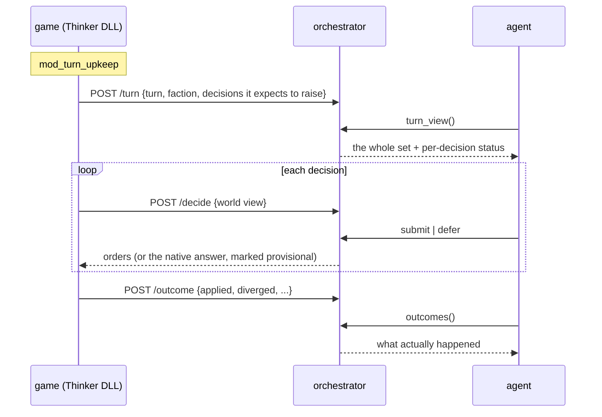

# Turn-scoped play — seeing the turn, learning the outcome, and choosing the order

An agent playing today answers **one decision at a time, blind to its siblings, and never learns
what happened**. It cannot see the other fifty bases waiting behind the one in front of it, it is
never told whether the order it gave was actually applied, and it cannot say "hold this one, ask
me again once I have moved the units".

Those four gaps are the subject of this document. Companion to
[agent-play.md](agent-play.md), which describes the mode as **built**; this describes what it
cannot yet do and what the code actually permits. Tracked as `na-8ja`.

**None of this is built.** Said plainly and up front, in the manner of
[policy-harness.md](policy-harness.md), because a design doc that reads like a feature list is
how a plan becomes a claim.

---

## 1. What is being asked for

1. **See all events for a turn** — the whole picture, not the oldest single decision.
2. **Decide against that picture** — spend a limited pool where it matters most, across bases.
3. **Receive feedback from execution** — did the order apply, and did the engine keep it.
4. **Defer a decision** — hold one open until other moves are made, so dependent moves can be
   chained across units and builds.

They are not equally hard. One is nearly free, one is structurally constrained, and the
constraint has an escape hatch that already exists in the code for a different reason.

## 2. The constraint: the decision hook must answer now

The engine calls the adapter *inside* its own base-processing loop:

```c
int na_decide_base_production(int base_id, int native_choice, int has_gov) {
    ...
    return applied;          // an item id, consumed by the engine immediately
}
```

`na_decide_base_production` POSTs `/decide`, blocks up to `conf.llm_timeout_ms`, and hands an
item id straight back. **There is no return value meaning "ask me later."** The adapter says why
in its own comment: *"Synchronous because the engine is not thread-safe and mod_base_build's
signature ..."*, and [agent-play.md §4](agent-play.md) documents the related reason the wait
deliberately does not pump the message queue — re-entering the engine from inside a decision hook
corrupts turns.

So **defer can never mean "return nothing."** Any deferral has to be a provisional answer that is
later revised.

## 3. The escape hatch: the engine already asks more than once

```text
The engine asks the same base for a production choice several times in one turn:
mod_base_reset is hooked at eleven call sites and each one runs mod_base_build
followed by mod_base_change — so every call *applies* its own answer, and the
last one to run is what the base actually builds.

Measured in real play: 21 of 24 base-turns fired twice, 11 of those pairs
disagreeing on the choice.
```

**Last answer wins.** Revision is not a feature to invent; it is how the engine already behaves.

### But the adapter deliberately suppresses the second ask

```c
const int call_seq = na_next_call_seq(base_id);
int cached = 0;
if (call_seq > 1 && na_cache_get(base_id, &cached)) {
    if (na_item_is_legal(base_id, cached)) {
        return cached;              // replay — the agent is never asked again
    }
    ...
}
```

The agent is asked exactly **once** per base-turn, at `call_seq == 1`. Every later call replays
from cache (re-verified for legality first — see [agent-play.md §7](agent-play.md)).

That cache is the seam. **The mechanism for a second bite already exists and is switched off by
one branch.** A deferred decision is one the adapter does not cache, so `call_seq == 2` falls
through to a real `/decide` and the agent answers again — this time knowing what the rest of the
turn needs.

This is why defer is tractable at all, and it is a much smaller change than "make the engine
re-ask".

## 4. Reversibility is per surface, and this is the part to get wrong carefully

| surface | fires | revisable? |
| --- | --- | --- |
| `base.production` | ~2× per base-turn | **Yes** — the build item is a queue setting; last write wins |
| `base.hurry` | per base-turn | **No** — spends energy credits irreversibly at apply |
| `faction.tech` | every 5–10 turns | Needs checking; fires once per faction-turn |
| `faction.se` | per faction-turn | Needs checking |

`na.toml` already singles out `base.hurry` as *"the one that spends something irreversibly once
it applies"*. A provisional *"yes, hurry"* cannot be taken back. On that surface, defer can only
mean **"decline now, and be willing to be re-offered"** — a weaker guarantee, and one an agent
must not confuse with the base.production kind.

So `revisable` belongs in the frozen registry (`surfaces.py`) as a per-surface property, next to
the instrumentation flags. Not a global mode.

## 5. Execution feedback already exists, and is thrown away

This is the cheap one, and the asymmetry is stark: **the adapter computes the outcome in full and
writes it to a local file the orchestrator never reads.**

Per decision, appended to the record after the call returns:

```text
tier · applied · applied_item · applied_item_name · fallback_reason
```

And a *separate* post-apply check, `na_verify_base_production`, reads the base's item back **after**
the apply and emits its own event when they disagree:

```json
{"surface_id":"base.production","event":"divergence",
 "intended_item_name":"Recycling Tanks","applied_item_name":"Scout Patrol",
 "fallback_reason":"engine did not keep the applied item"}
```

Its comment explains why it exists, and it is exactly the thing an agent cannot infer:

> not "should the engine accept this" but "did it" … That needs no knowledge of WHY a choice was
> dropped, which is the point — it is the one check that covers rules we have not learned yet.

The orchestrator's picture of its own effect is therefore not incomplete, it is **absent**, while
the adapter holds it in full. Routing it back is plumbing, not new observation.

## 6. Why the turn view needs the adapter to speak first

The orchestrator cannot show a turn it has not been told about. At the moment base #1 is asked,
bases #2..#51 **have not been POSTed yet** — they do not exist as far as the queue is concerned.
`/agent/next` claiming "the oldest pending decision" is not an arbitrary API choice; it is all
the orchestrator knows.

So a turn view requires the adapter to **announce the turn's decision set up front**.
`mod_turn_upkeep` is the seam — the adapter already describes it as *"the engine's between-turns
seam ... hooked into control_turn"*, and it is where the auto-turn logic already lives.



An announced set is a *forecast*, not a promise — the engine may raise fewer decisions than
expected (a base captured mid-turn, a project completing). The view must therefore distinguish
`expected` from `raised`, or an agent will wait for a decision that is never coming.

## 7. Build order

**Phase 1 — outcome feedback.** Adapter POSTs the fields it already computes, keyed by decision
id; orchestrator stores them against the decision record and exposes them. Independent of
everything else, changes no blocking semantics, and satisfies ask (3) outright.

**Phase 2 — turn-scoped view.** Announce at `mod_turn_upkeep`; expose the set with per-decision
status (`expected` / `raised` / `answered` / `applied` / `diverged`). Satisfies (1) and most of (2).

**Phase 3 — defer and chain.** Suppress the cache for a deferred decision so the next `call_seq`
re-asks. Requires the per-surface `revisable` flag from §4.

**Phase 1 first, and not as an arbitrary ordering.** A revision loop without outcome feedback is
flown blind: "did my revision take" is precisely the question `na_verify_base_production` was
written to answer, and Phase 3 without Phase 1 asks an agent to revise decisions whose results it
cannot see.

## 8. The failure mode to design against

**A defer that silently becomes the native answer.**

The number of calls per base-turn is not guaranteed. The same measurement that gives us
last-answer-wins also says **21 of 24 base-turns fired twice** — so *three did not*. On those, a
deferred decision has no second call to be revised in, and the provisional answer stands.

In the record that is indistinguishable from an agent that chose the engine's pick deliberately.
It is the same shape as the failures this project keeps meeting and keeps writing down: a knob
that reports success and does nothing (na-wzw, na-t3h, the plan store in a4deef7), a check that
proves the wrong thing, a zero that means "not computed" and reads as a measurement.

So a deferral must be **recorded as a deferral** — carrying its own tier or reason, never folded
into the ordinary decision record — and an agent must be told when its deferral expired unused.
An expired defer is a real event, not the absence of one.

---

## See also

- [agent-play.md](agent-play.md) — the mode as it exists today
- [contract.md](contract.md) — the world view and orders this does not change
- [observability.md](observability.md) — where decision records go
- [game-surface.md](game-surface.md) — the frozen surface registry §4 would extend
